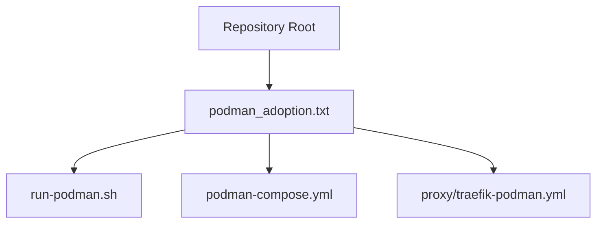
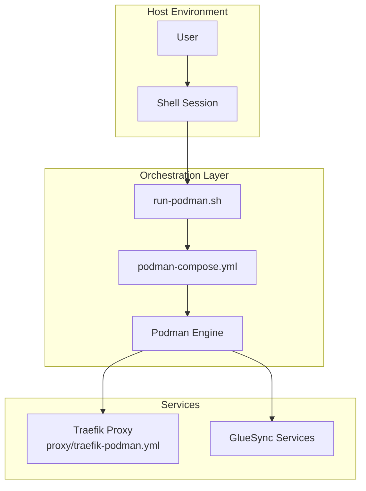
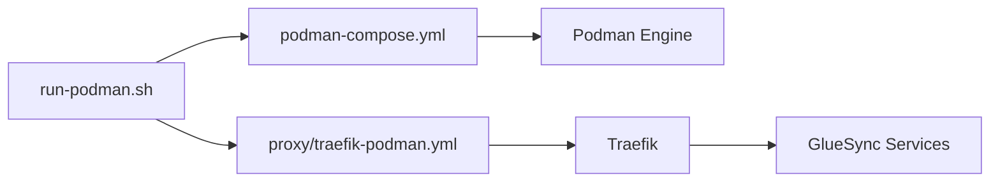

# Container Management

<cite>
**Referenced Files in This Document**
- [podman_adoption.txt](file://podman_adoption.txt)
</cite>

## Table of Contents
1. [Introduction](#introduction)
2. [Project Structure](#project-structure)
3. [Core Components](#core-components)
4. [Architecture Overview](#architecture-overview)
5. [Detailed Component Analysis](#detailed-component-analysis)
6. [Dependency Analysis](#dependency-analysis)
7. [Performance Considerations](#performance-considerations)
8. [Troubleshooting Guide](#troubleshooting-guide)
9. [Conclusion](#conclusion)
10. [Appendices](#appendices)

## Introduction
This document provides comprehensive guidance for container management in a Podman-based environment, focusing on the adoption and operational procedures captured in the repository. It explains how to prepare and execute container management tasks, interpret outcomes, monitor service status, manage logs, and troubleshoot common issues. It also outlines the relationship between container orchestration and the GlueSync deployment and highlights security considerations for container management operations.

## Project Structure
The repository contains a single historical record file that documents the steps taken to adopt Podman for container orchestration. The file references:
- A shell script named run-podman.sh
- A Podman compose configuration file named podman-compose.yml
- A proxy configuration file named traefik-podman.yml
- A GlueSync deployment context

**Diagram sources**
- [podman_adoption.txt:1-16](file://podman_adoption.txt#L1-L16)

**Section sources**
- [podman_adoption.txt:1-16](file://podman_adoption.txt#L1-L16)

## Core Components
The core components involved in container management and orchestration are:
- Orchestration script: run-podman.sh
- Orchestration configuration: podman-compose.yml
- Proxy configuration: proxy/traefik-podman.yml
- Deployment context: GlueSync

These components collectively enable service orchestration and lifecycle management through Podman.

**Section sources**
- [podman_adoption.txt:1-16](file://podman_adoption.txt#L1-L16)

## Architecture Overview
The architecture centers on using Podman as the container engine with podman-compose for orchestrating multi-container deployments. The GlueSync deployment relies on this orchestration to manage services such as Traefik for reverse proxying and other backend services.

**Diagram sources**
- [podman_adoption.txt:1-16](file://podman_adoption.txt#L1-L16)

## Detailed Component Analysis

### Orchestration Script: run-podman.sh
Purpose:
- Provides a unified entry point for container lifecycle operations (start, stop, restart, status checks).
- Ensures proper permissions and ownership for orchestration assets prior to execution.

Key responsibilities:
- Execution permissions management for the script itself.
- Ownership management for configuration files and the script.
- Invocation of podman-compose commands to manage services.

Operational flow:
- Prepare environment by setting executable permissions and correct ownership.
- Change to the deployment directory.
- Bring services down using docker-compose (transition step).
- Inspect the orchestration script.
- Execute the orchestration script.
- Install podman-compose via Python pip if unavailable.
- Verify podman-compose installation.

Security considerations:
- Ensure the script and configuration files are owned by the intended user/group.
- Limit execution privileges to authorized users only.

**Section sources**
- [podman_adoption.txt:1-16](file://podman_adoption.txt#L1-L16)

### Orchestration Configuration: podman-compose.yml
Purpose:
- Defines the containerized services to be orchestrated, including service dependencies, networking, volumes, and environment variables.

Lifecycle management:
- Used by podman-compose to bring services up/down and manage their state.
- Supports scaling, health checks, and resource constraints when configured.

Integration with GlueSync:
- Coordinates Traefik and other backend services required by GlueSync.

**Section sources**
- [podman_adoption.txt:1-16](file://podman_adoption.txt#L1-L16)

### Proxy Configuration: proxy/traefik-podman.yml
Purpose:
- Configures Traefik as a reverse proxy for GlueSync and related services.
- Defines routing rules, middleware, and TLS termination policies.

Operational impact:
- Enables external access to GlueSync services through secure routes.
- Integrates with the orchestration layer to expose services consistently.

**Section sources**
- [podman_adoption.txt:1-16](file://podman_adoption.txt#L1-L16)

### GlueSync Deployment Context
Relationship to container management:
- GlueSync depends on orchestrated services (including Traefik) for network exposure and routing.
- Container management ensures the availability and reliability of GlueSync endpoints.

Monitoring and maintenance:
- Health checks and logs from orchestrated services inform GlueSync’s operational status.
- Lifecycle operations (start/stop/restart) directly affect GlueSync availability windows.

**Section sources**
- [podman_adoption.txt:1-16](file://podman_adoption.txt#L1-L16)

## Dependency Analysis
The orchestration pipeline depends on the following relationships:
- run-podman.sh depends on podman-compose.yml and proxy/traefik-podman.yml.
- podman-compose.yml depends on the Podman engine and installed plugins.
- Traefik configuration depends on network policies and service discovery.
- GlueSync deployment depends on Traefik and backend services managed by podman-compose.yml.

**Diagram sources**
- [podman_adoption.txt:1-16](file://podman_adoption.txt#L1-L16)

**Section sources**
- [podman_adoption.txt:1-16](file://podman_adoption.txt#L1-L16)

## Performance Considerations
- Resource allocation: Configure CPU and memory limits in podman-compose.yml to prevent contention among services.
- Network efficiency: Optimize Traefik routing rules to minimize latency and improve throughput.
- Storage: Use dedicated volumes for persistent data and configure backup schedules.
- Scaling: Evaluate horizontal scaling strategies for GlueSync components under load.
- Monitoring overhead: Enable metrics collection without impacting service performance.

[No sources needed since this section provides general guidance]

## Troubleshooting Guide
Common issues and resolutions:
- Permission errors during script execution:
  - Ensure the script and configuration files are owned by the correct user/group.
  - Verify executable permissions are set before invoking the script.
- Podman-compose installation failures:
  - Install Python pip and use a user-local installation to avoid system-wide conflicts.
  - Add the user’s local bin directory to PATH and reload the shell session.
- Service startup failures:
  - Review Traefik and GlueSync logs for error messages.
  - Validate network connectivity and port availability.
- Transition from Docker Compose:
  - Use docker-compose down to clean up legacy containers before switching to podman-compose.
- Version verification:
  - Confirm podman-compose installation by checking its version after installation.

Security and permission handling:
- Restrict write access to orchestration scripts and configuration files.
- Run the orchestration script with least privilege necessary.
- Audit ownership and permissions regularly to prevent unauthorized changes.

**Section sources**
- [podman_adoption.txt:1-16](file://podman_adoption.txt#L1-L16)

## Conclusion
The repository demonstrates a practical adoption path for Podman-based container orchestration, centered around run-podman.sh, podman-compose.yml, and proxy/traefik-podman.yml. By following the documented procedures—ensuring proper permissions, installing podman-compose, and executing the orchestration script—you can reliably manage GlueSync services. Proper monitoring, logging, and troubleshooting practices will help maintain service availability and performance.

[No sources needed since this section summarizes without analyzing specific files]

## Appendices
- Typical management operations:
  - Prepare environment: set executable permissions and ownership.
  - Change to deployment directory.
  - Clean up legacy Docker Compose services.
  - Inspect and execute the orchestration script.
  - Install and verify podman-compose.
- Expected results:
  - Successful installation of podman-compose.
  - Services defined in podman-compose.yml are started and reachable via Traefik.
  - Logs indicate healthy service states and no critical errors.

[No sources needed since this section provides general guidance]