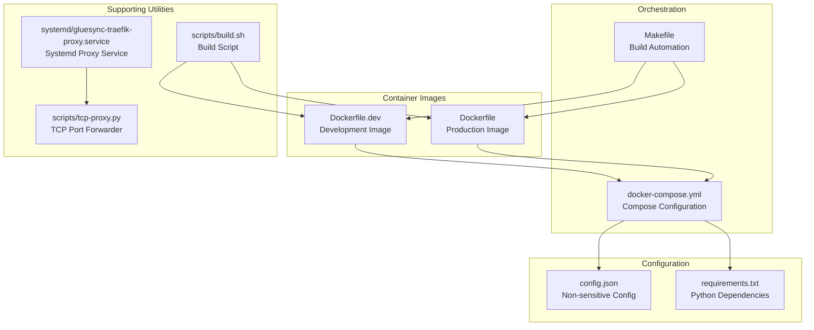
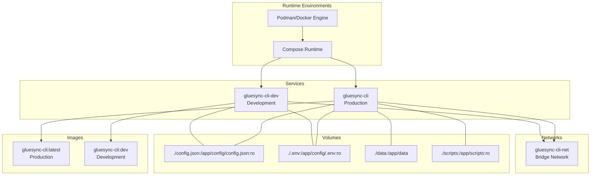
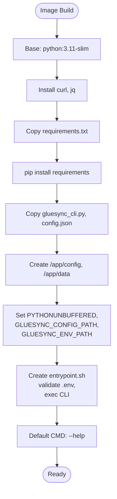
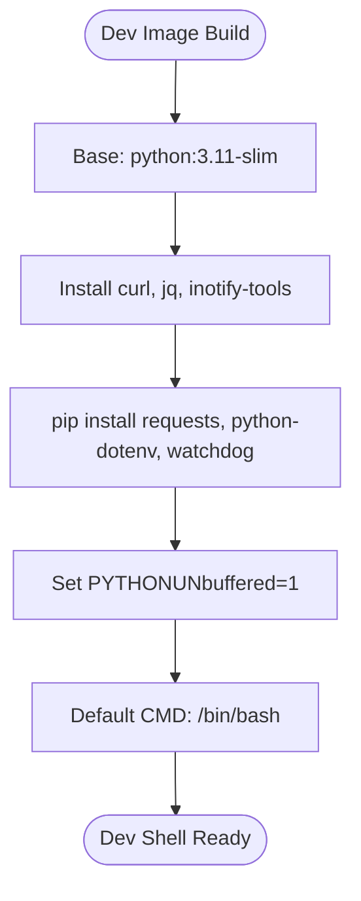
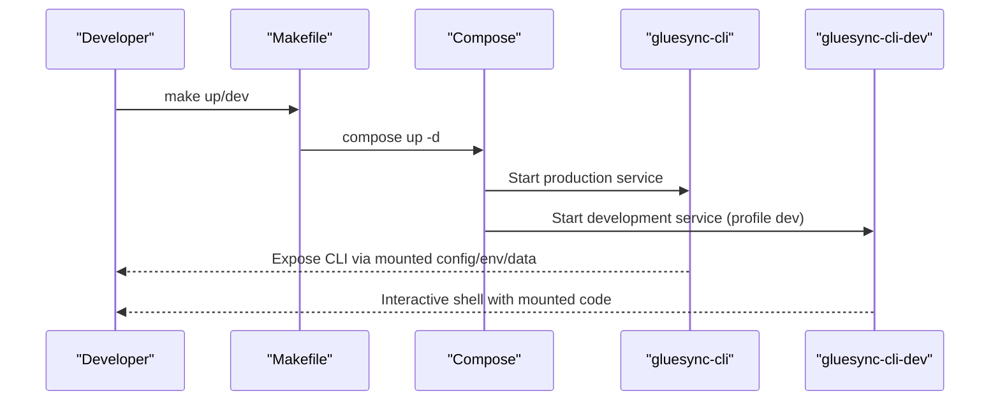
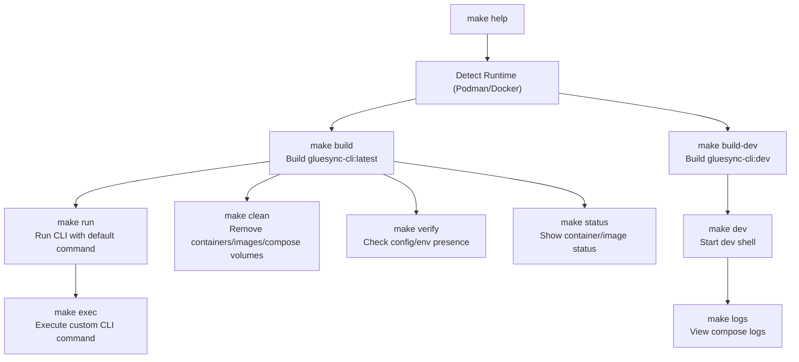
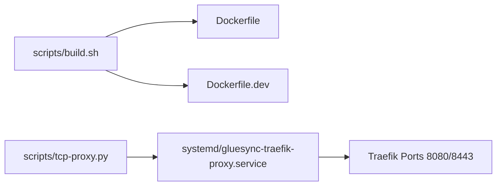
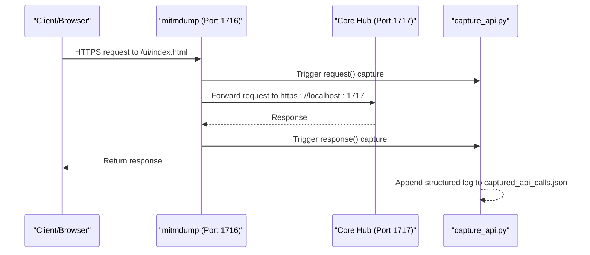
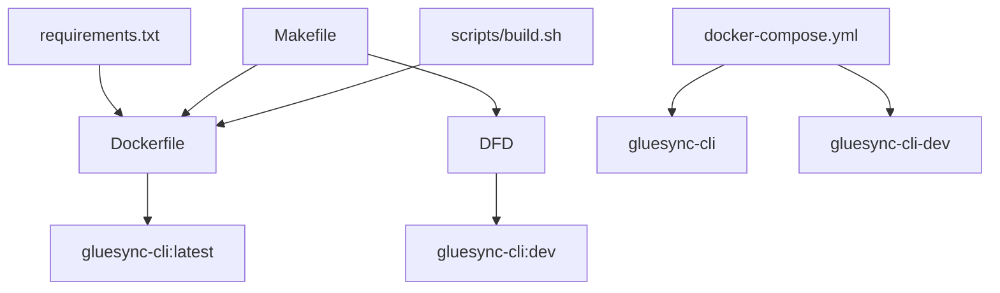

# Containerization Infrastructure

<cite>
**Referenced Files in This Document**
- [Dockerfile](file://Dockerfile)
- [Dockerfile.dev](file://Dockerfile.dev)
- [docker-compose.yml](file://docker-compose.yml)
- [Makefile](file://Makefile)
- [README.md](file://README.md)
- [requirements.txt](file://requirements.txt)
- [config.json](file://config.json)
- [scripts/build.sh](file://scripts/build.sh)
- [scripts/tcp-proxy.py](file://scripts/tcp-proxy.py)
- [systemd/gluesync-traefik-proxy.service](file://systemd/gluesync-traefik-proxy.service)
- [MITM_PROXY.md](file://MITM_PROXY.md)
- [start-mitm-capture.sh](file://start-mitm-capture.sh)
- [capture_api.py](file://capture_api.py)
- [core-hub-mitm.sh](file://core-hub-mitm.sh)
</cite>

## Table of Contents
1. [Introduction](#introduction)
2. [Project Structure](#project-structure)
3. [Core Components](#core-components)
4. [Architecture Overview](#architecture-overview)
5. [Detailed Component Analysis](#detailed-component-analysis)
6. [Dependency Analysis](#dependency-analysis)
7. [Performance Considerations](#performance-considerations)
8. [Troubleshooting Guide](#troubleshooting-guide)
9. [Conclusion](#conclusion)

## Introduction
This document describes the containerization infrastructure for the GlueSync CLI tool. It covers the production and development container images, orchestration with Docker Compose, build automation with Make, and supporting utilities for API capture and reverse engineering. The infrastructure emphasizes externalized configuration, secure credential management, and flexible deployment options using either Docker or Podman.

## Project Structure
The containerization setup centers around three primary artifacts:
- Production container image definition
- Development container image definition with hot-reload capabilities
- Orchestration configuration for both environments

**Diagram sources**
- [Dockerfile:1-40](file://Dockerfile#L1-L40)
- [Dockerfile.dev:1-24](file://Dockerfile.dev#L1-L24)
- [docker-compose.yml:1-52](file://docker-compose.yml#L1-L52)
- [Makefile:1-112](file://Makefile#L1-L112)
- [scripts/build.sh:1-80](file://scripts/build.sh#L1-L80)
- [scripts/tcp-proxy.py:1-72](file://scripts/tcp-proxy.py#L1-L72)
- [systemd/gluesync-traefik-proxy.service:1-13](file://systemd/gluesync-traefik-proxy.service#L1-L13)
- [config.json:1-34](file://config.json#L1-L34)
- [requirements.txt:1-3](file://requirements.txt#L1-L3)

**Section sources**
- [README.md:94-128](file://README.md#L94-L128)
- [docker-compose.yml:1-52](file://docker-compose.yml#L1-L52)
- [Makefile:1-112](file://Makefile#L1-L112)

## Core Components
- Production container image: Built from a slim Python base, installs system dependencies, copies application code and configuration, sets environment variables, and defines an entrypoint that validates the presence of the environment file.
- Development container image: Extends the production image with inotify-tools and development libraries for hot-reload scenarios, with a default interactive shell.
- Orchestration: Compose defines two services (production and development) with shared networking, volume mounts for configuration and data, and environment variable propagation.
- Build automation: Makefile detects Podman or Docker, builds images, runs containers, starts development shells, manages compose lifecycle, and provides verification and cleanup tasks.

**Section sources**
- [Dockerfile:1-40](file://Dockerfile#L1-L40)
- [Dockerfile.dev:1-24](file://Dockerfile.dev#L1-L24)
- [docker-compose.yml:1-52](file://docker-compose.yml#L1-L52)
- [Makefile:1-112](file://Makefile#L1-L112)

## Architecture Overview
The containerization architecture supports both direct operation and development modes, with optional MITM proxying for API capture and reverse engineering. The production image runs the CLI with mounted configuration and data volumes, while the development image enables interactive editing and hot-reload scenarios.

**Diagram sources**
- [docker-compose.yml:1-52](file://docker-compose.yml#L1-L52)
- [Dockerfile:1-40](file://Dockerfile#L1-L40)
- [Dockerfile.dev:1-24](file://Dockerfile.dev#L1-L24)

## Detailed Component Analysis

### Production Container Image (Dockerfile)
The production image:
- Uses a Python 3.11 slim base image
- Installs system dependencies (curl, jq)
- Copies and installs Python dependencies from requirements.txt
- Copies application files (CLI and configuration)
- Creates directories for config and data
- Sets environment variables for configuration and environment paths
- Defines an entrypoint script that warns if the environment file is missing and executes the CLI

**Diagram sources**
- [Dockerfile:1-40](file://Dockerfile#L1-L40)

**Section sources**
- [Dockerfile:1-40](file://Dockerfile#L1-L40)
- [requirements.txt:1-3](file://requirements.txt#L1-L3)

### Development Container Image (Dockerfile.dev)
The development image:
- Extends the production base
- Adds inotify-tools for monitoring file changes
- Installs development dependencies (requests, python-dotenv, watchdog)
- Sets environment variables for unbuffered output
- Defaults to an interactive bash shell

**Diagram sources**
- [Dockerfile.dev:1-24](file://Dockerfile.dev#L1-L24)

**Section sources**
- [Dockerfile.dev:1-24](file://Dockerfile.dev#L1-L24)

### Orchestration with Docker Compose
Compose defines:
- Two services: gluesync-cli (production) and gluesync-cli-dev (development)
- Shared bridge network gluesync-cli-net
- Volume mounts for configuration, environment, data, and scripts
- Environment variables propagated from host to containers
- Development profile enabling hot-reload scenarios

**Diagram sources**
- [docker-compose.yml:1-52](file://docker-compose.yml#L1-L52)
- [Makefile:57-70](file://Makefile#L57-L70)

**Section sources**
- [docker-compose.yml:1-52](file://docker-compose.yml#L1-L52)
- [Makefile:57-70](file://Makefile#L57-L70)

### Build Automation with Makefile
The Makefile:
- Detects Podman or Docker and selects appropriate commands
- Provides targets for building images, running containers, starting shells, and development mode
- Manages compose lifecycle (up/down/logs), testing, installation, cleanup, verification, and status
- Supports both Docker and Podman Compose interchangeably

**Diagram sources**
- [Makefile:1-112](file://Makefile#L1-L112)

**Section sources**
- [Makefile:1-112](file://Makefile#L1-L112)

### Supporting Utilities
- Build script: Provides runtime detection, file checks, image build, and basic CLI verification.
- TCP port forwarder: Simple Python utility to forward TCP connections between ports.
- Systemd proxy service: Runs socat listeners on ports 80/443 to forward to Traefik ports 8080/8443.

**Diagram sources**
- [scripts/build.sh:1-80](file://scripts/build.sh#L1-L80)
- [scripts/tcp-proxy.py:1-72](file://scripts/tcp-proxy.py#L1-L72)
- [systemd/gluesync-traefik-proxy.service:1-13](file://systemd/gluesync-traefik-proxy.service#L1-L13)

**Section sources**
- [scripts/build.sh:1-80](file://scripts/build.sh#L1-L80)
- [scripts/tcp-proxy.py:1-72](file://scripts/tcp-proxy.py#L1-L72)
- [systemd/gluesync-traefik-proxy.service:1-13](file://systemd/gluesync-traefik-proxy.service#L1-L13)

### MITM Proxy for API Capture
The MITM proxy setup enables capturing GlueSync API calls for reverse engineering and documentation:
- Port separation principle: 1716 for captured traffic, 1717 for direct access
- Reverse proxy mode: mitmdump forwards to Core Hub on 1717 while capturing logs
- Capture script filters API endpoints and writes structured logs to JSON
- Additional scripts demonstrate alternative capture strategies and backend integration

**Diagram sources**
- [MITM_PROXY.md:37-66](file://MITM_PROXY.md#L37-L66)
- [start-mitm-capture.sh:1-51](file://start-mitm-capture.sh#L1-L51)
- [capture_api.py:1-90](file://capture_api.py#L1-L90)

**Section sources**
- [MITM_PROXY.md:1-340](file://MITM_PROXY.md#L1-L340)
- [start-mitm-capture.sh:1-51](file://start-mitm-capture.sh#L1-L51)
- [capture_api.py:1-90](file://capture_api.py#L1-L90)
- [core-hub-mitm.sh:1-49](file://core-hub-mitm.sh#L1-L49)

## Dependency Analysis
The containerization stack exhibits clear separation of concerns:
- Build-time dependencies: Python packages defined in requirements.txt
- Runtime dependencies: System packages installed in the container images
- Orchestration dependencies: Compose service definitions and environment propagation
- Development dependencies: Additional Python packages for development mode

**Diagram sources**
- [requirements.txt:1-3](file://requirements.txt#L1-L3)
- [Dockerfile:1-40](file://Dockerfile#L1-L40)
- [Dockerfile.dev:1-24](file://Dockerfile.dev#L1-L24)
- [docker-compose.yml:1-52](file://docker-compose.yml#L1-L52)
- [Makefile:1-112](file://Makefile#L1-L112)
- [scripts/build.sh:1-80](file://scripts/build.sh#L1-L80)

**Section sources**
- [requirements.txt:1-3](file://requirements.txt#L1-L3)
- [Dockerfile:1-40](file://Dockerfile#L1-L40)
- [Dockerfile.dev:1-24](file://Dockerfile.dev#L1-L24)
- [docker-compose.yml:1-52](file://docker-compose.yml#L1-L52)
- [Makefile:1-112](file://Makefile#L1-L112)
- [scripts/build.sh:1-80](file://scripts/build.sh#L1-L80)

## Performance Considerations
- Production vs development: The production image excludes development tools to minimize size and attack surface, while the development image includes inotify-tools and watchdog for hot-reload scenarios.
- Volume mounting: Mounting configuration and data directories reduces rebuild frequency and enables persistent state.
- Logging overhead: The MITM proxy introduces additional processing for request/response capture; use 1716 only when capturing is required to avoid performance impact compared to direct 1717 access.
- Network isolation: Using a dedicated bridge network isolates services and simplifies inter-service communication.

## Troubleshooting Guide
Common issues and resolutions:
- Port conflicts: Ensure ports 1716/1717 are free before starting MITM; verify Traefik ports 8080/8443 availability.
- Missing configuration: Confirm config.json and .env are present and mounted correctly; the production entrypoint warns if .env is missing.
- Container runtime detection: The Makefile automatically selects Podman or Docker; verify the detected runtime matches expectations.
- Compose profile activation: Development mode requires the dev profile; ensure compose is invoked with the appropriate profile flag.
- MITM SSL warnings: Accept the certificate in the browser or install the mitmproxy CA certificate to avoid SSL errors during capture.

**Section sources**
- [Makefile:98-112](file://Makefile#L98-L112)
- [Dockerfile:29-39](file://Dockerfile#L29-L39)
- [start-mitm-capture.sh:26-40](file://start-mitm-capture.sh#L26-L40)
- [MITM_PROXY.md:284-330](file://MITM_PROXY.md#L284-L330)

## Conclusion
The containerization infrastructure provides a robust, flexible foundation for deploying and developing the GlueSync CLI. It supports both production and development workflows, integrates with Docker/Podman seamlessly, and includes tools for API capture and reverse engineering. By externalizing configuration and credentials, the setup enhances security and maintainability while preserving ease of use through automation and orchestration.