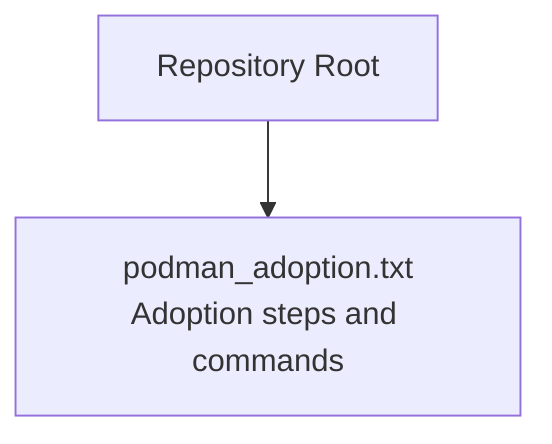
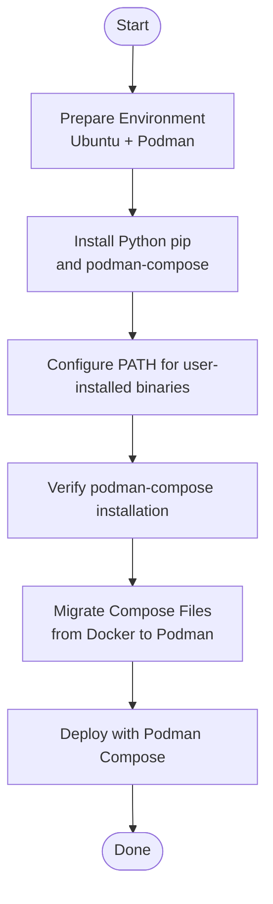
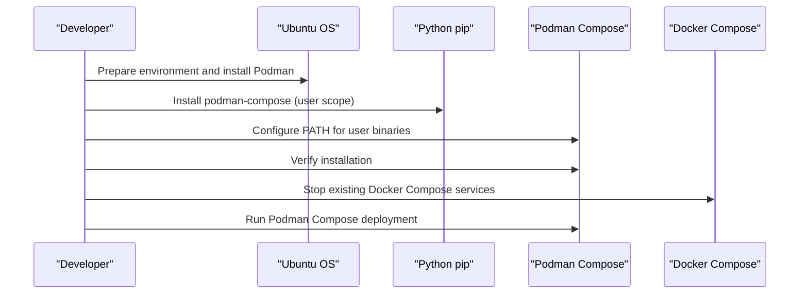
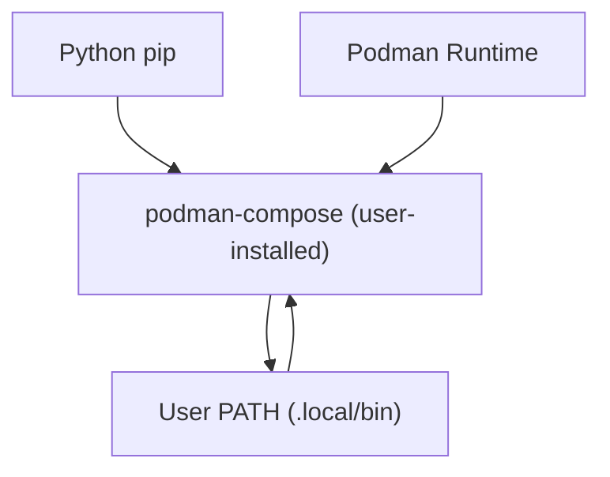

# Getting Started

<cite>
**Referenced Files in This Document**
- [podman_adoption.txt](file://podman_adoption.txt)
</cite>

## Table of Contents
1. [Introduction](#introduction)
2. [Project Structure](#project-structure)
3. [Core Components](#core-components)
4. [Architecture Overview](#architecture-overview)
5. [Detailed Component Analysis](#detailed-component-analysis)
6. [Dependency Analysis](#dependency-analysis)
7. [Performance Considerations](#performance-considerations)
8. [Troubleshooting Guide](#troubleshooting-guide)
9. [Conclusion](#conclusion)

## Introduction
This guide helps you adopt Podman for containerized deployments by transitioning from Docker Compose workflows. It covers Ubuntu prerequisites, Podman installation, Python dependencies, initial setup (permissions and ownership), installing podman-compose via pip3, verification steps, and the basic workflow from Docker Compose down to Podman deployment. The content is designed for beginners while ensuring technical completeness.

## Project Structure
The repository contains a single log-like file that documents the adoption steps and commands used during the transition. It demonstrates:
- Changing permissions and ownership for scripts and compose files
- Switching from Docker Compose to Podman Compose
- Installing Python dependencies and configuring PATH for user-installed packages

**Diagram sources**
- [podman_adoption.txt:1-16](file://podman_adoption.txt#L1-L16)

**Section sources**
- [podman_adoption.txt:1-16](file://podman_adoption.txt#L1-L16)

## Core Components
Key elements documented in the adoption log:
- Permission configuration for shell scripts and compose files
- Ownership setup for compose files and scripts
- Transition from Docker Compose to Podman Compose
- Installation of Python pip and podman-compose using pip3
- PATH configuration for user-installed binaries
- Verification of podman-compose installation

These steps collectively represent the minimal setup required to run Podman-based deployments locally on Ubuntu.

**Section sources**
- [podman_adoption.txt:1-16](file://podman_adoption.txt#L1-L16)

## Architecture Overview
The high-level workflow from Docker Compose to Podman deployment is illustrated below. It shows the shift from Docker Compose to Podman Compose, including environment preparation, dependency installation, and verification.

[No sources needed since this diagram shows conceptual workflow, not actual code structure]

## Detailed Component Analysis

### Permission and Ownership Setup
Before running Podman Compose, ensure the execution script and compose files have correct permissions and ownership. The adoption log demonstrates:
- Making the run script executable
- Setting ownership to the current user and group
- Applying ownership to compose files and the run script

These steps prevent permission-related errors during deployment.

**Section sources**
- [podman_adoption.txt:1-2](file://podman_adoption.txt#L1-L2)

### Transition from Docker Compose to Podman Compose
The adoption log shows:
- Stopping existing Docker Compose services
- Running the Podman Compose run script
- Confirming that the Podman Compose package is not available in standard repositories

This indicates the need to install podman-compose via pip3.

**Section sources**
- [podman_adoption.txt:5-7](file://podman_adoption.txt#L5-L7)
- [podman_adoption.txt:8-9](file://podman_adoption.txt#L8-L9)

### Installing Python Dependencies and Podman Compose
The adoption log documents:
- Updating package lists
- Installing Python pip
- Installing podman-compose using pip3 with user scope
- Adding the user’s local bin directory to PATH
- Sourcing the updated PATH
- Verifying podman-compose installation

This sequence ensures podman-compose is available without requiring system-wide installation.

**Section sources**
- [podman_adoption.txt:10-15](file://podman_adoption.txt#L10-L15)

### Basic Workflow from Docker Compose Down to Podman Deployment
The following sequence summarizes the documented workflow:
1. Prepare environment and install Podman
2. Install Python pip and podman-compose via pip3
3. Configure PATH for user-installed binaries
4. Verify podman-compose installation
5. Migrate compose files from Docker to Podman
6. Run the deployment using Podman Compose

**Diagram sources**
- [podman_adoption.txt:5-15](file://podman_adoption.txt#L5-L15)

**Section sources**
- [podman_adoption.txt:5-15](file://podman_adoption.txt#L5-L15)

## Dependency Analysis
The adoption log highlights the following dependencies and relationships:
- Podman runtime for containerization
- Python pip for installing podman-compose
- User-installed podman-compose binary located under the user’s local bin directory
- PATH configuration enabling access to the installed binary

**Diagram sources**
- [podman_adoption.txt:10-15](file://podman_adoption.txt#L10-L15)

**Section sources**
- [podman_adoption.txt:10-15](file://podman_adoption.txt#L10-L15)

## Performance Considerations
- Using user-scoped pip installation avoids system-level conflicts and reduces administrative overhead.
- Keeping PATH updated ensures immediate availability of podman-compose after installation.
- Running Podman Compose with the provided run script encapsulates environment-specific configurations.

[No sources needed since this section provides general guidance]

## Troubleshooting Guide
Common issues and their resolutions based on the adoption log:
- Podman Compose not available in standard repositories: Install via pip3 with user scope and configure PATH accordingly.
- Permission errors when running scripts or accessing compose files: Set executable permissions and correct ownership as shown in the adoption log.
- PATH not updated after installation: Add the user’s local bin directory to PATH and source the updated configuration.

**Section sources**
- [podman_adoption.txt:8-15](file://podman_adoption.txt#L8-L15)

## Conclusion
By following the documented steps—preparing the Ubuntu environment, installing Python pip, installing podman-compose via pip3, configuring PATH, verifying the installation, and migrating compose files—you can successfully transition from Docker Compose to Podman deployment. The adoption log provides a practical, beginner-friendly pathway to achieve this goal with minimal friction.