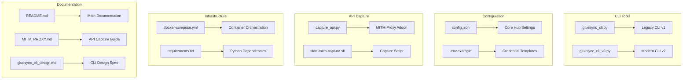
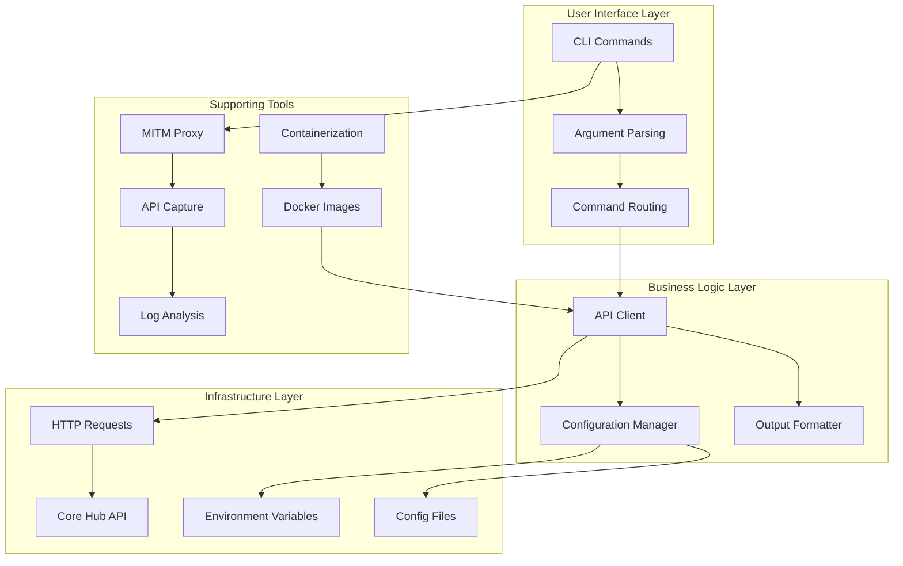
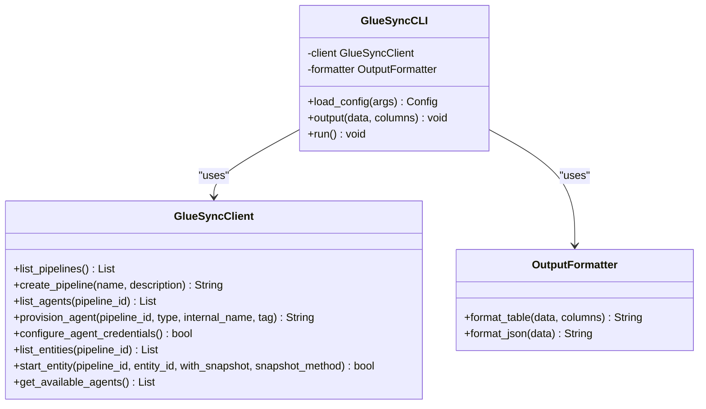
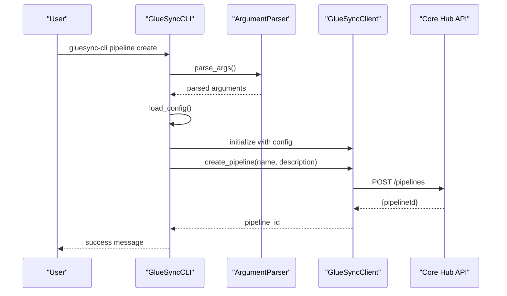
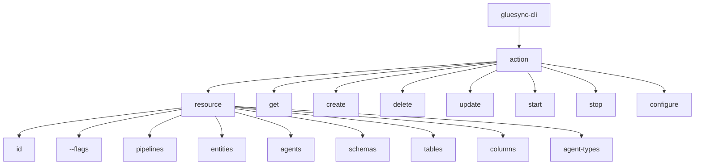
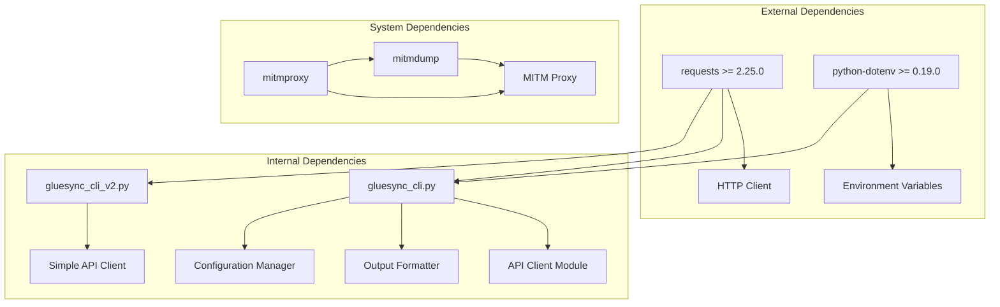

# CLI Tools

<cite>
**Referenced Files in This Document**
- [gluesync_cli.py](file://gluesync_cli.py)
- [gluesync_cli_v2.py](file://gluesync_cli_v2.py)
- [README.md](file://README.md)
- [config.json](file://config.json)
- [.env.example](file://.env.example)
- [requirements.txt](file://requirements.txt)
- [MITM_PROXY.md](file://MITM_PROXY.md)
- [capture_api.py](file://capture_api.py)
- [start-mitm-capture.sh](file://start-mitm-capture.sh)
- [docker-compose.yml](file://docker-compose.yml)
- [gluesync_cli_design.md](file://gluesync_cli_design.md)
</cite>

## Table of Contents
1. [Introduction](#introduction)
2. [Project Structure](#project-structure)
3. [Core Components](#core-components)
4. [Architecture Overview](#architecture-overview)
5. [Detailed Component Analysis](#detailed-component-analysis)
6. [Dependency Analysis](#dependency-analysis)
7. [Performance Considerations](#performance-considerations)
8. [Troubleshooting Guide](#troubleshooting-guide)
9. [Conclusion](#conclusion)

## Introduction

The GlueSync CLI Tools project provides a comprehensive command-line interface ecosystem for managing GlueSync pipelines, agents, and entities. This project includes two distinct CLI implementations, an API capture and reverse engineering toolkit, and containerized deployment capabilities.

The CLI tools serve as the primary interface for automating GlueSync operations, enabling developers and administrators to manage data synchronization pipelines programmatically. The tools support both modern kubectl-style command patterns and legacy argument-based approaches, providing flexibility for different operational environments.

## Project Structure

The project follows a modular structure designed for maintainability and extensibility:



**Diagram sources**
- [gluesync_cli.py:1-743](file://gluesync_cli.py#L1-L743)
- [gluesync_cli_v2.py:1-111](file://gluesync_cli_v2.py#L1-L111)
- [config.json:1-34](file://config.json#L1-L34)
- [capture_api.py:1-90](file://capture_api.py#L1-L90)
- [start-mitm-capture.sh:1-51](file://start-mitm-capture.sh#L1-L51)
- [docker-compose.yml:1-52](file://docker-compose.yml#L1-L52)
- [README.md:1-492](file://README.md#L1-L492)

**Section sources**
- [README.md:94-128](file://README.md#L94-L128)
- [gluesync_cli.py:1-743](file://gluesync_cli.py#L1-L743)
- [gluesync_cli_v2.py:1-111](file://gluesync_cli_v2.py#L1-L111)

## Core Components

The CLI tools ecosystem consists of several interconnected components that work together to provide comprehensive pipeline management capabilities:

### Legacy CLI (v1) - Comprehensive Management Tool

The original CLI implementation provides extensive functionality for pipeline, agent, and entity management through a hierarchical command structure. It supports advanced features like automatic agent provisioning, credential configuration, and runtime operations.

**Key Features:**
- Pipeline CRUD operations (create, read, update, delete)
- Agent provisioning and configuration with auto-assignment
- Entity management with write method configuration
- Schema/table discovery capabilities
- Runtime operations (start, stop, status monitoring)
- Multiple output formats (table, JSON)

### Modern CLI (v2) - kubectl-style Interface

The newer CLI implementation follows Kubernetes-style command patterns, using a resource-action model that's more intuitive for modern DevOps workflows. This version focuses on essential operations while maintaining simplicity.

**Key Features:**
- Resource-action command structure (get, create, delete)
- Simplified pipeline and entity management
- Consistent output formatting
- Environment-based configuration

### API Capture and Reverse Engineering

The MITM proxy toolkit enables API discovery and reverse engineering through traffic capture and analysis. This component is crucial for understanding GlueSync's internal API structure and developing automation tools.

**Section sources**
- [gluesync_cli.py:290-743](file://gluesync_cli.py#L290-L743)
- [gluesync_cli_v2.py:18-111](file://gluesync_cli_v2.py#L18-L111)
- [MITM_PROXY.md:1-340](file://MITM_PROXY.md#L1-L340)

## Architecture Overview

The CLI tools architecture follows a layered design pattern with clear separation of concerns:



**Diagram sources**
- [gluesync_cli.py:47-253](file://gluesync_cli.py#L47-L253)
- [gluesync_cli_v2.py:18-54](file://gluesync_cli_v2.py#L18-L54)
- [capture_api.py:30-89](file://capture_api.py#L30-L89)

The architecture emphasizes modularity and separation of concerns, allowing each component to be developed, tested, and maintained independently while working together cohesively.

**Section sources**
- [gluesync_cli.py:290-743](file://gluesync_cli.py#L290-L743)
- [gluesync_cli_v2.py:67-111](file://gluesync_cli_v2.py#L67-L111)

## Detailed Component Analysis

### Legacy CLI v1 Implementation

The legacy CLI represents a comprehensive solution with extensive functionality:

#### Core Classes and Structure



**Diagram sources**
- [gluesync_cli.py:290-344](file://gluesync_cli.py#L290-L344)
- [gluesync_cli.py:47-168](file://gluesync_cli.py#L47-L168)
- [gluesync_cli.py:255-288](file://gluesync_cli.py#L255-L288)

#### Command Processing Flow



**Diagram sources**
- [gluesync_cli.py:574-743](file://gluesync_cli.py#L574-L743)
- [gluesync_cli.py:90-98](file://gluesync_cli.py#L90-L98)

#### Configuration Management

The CLI implements sophisticated configuration management supporting multiple sources:

**Configuration Sources (Priority Order):**
1. Environment Variables (highest priority)
2. Command-line Arguments
3. Configuration Files
4. Default Values

**Section sources**
- [gluesync_cli.py:297-334](file://gluesync_cli.py#L297-L334)
- [gluesync_cli.py:346-387](file://gluesync_cli.py#L346-L387)

### Modern CLI v2 Implementation

The modern CLI follows Kubernetes-style patterns for improved usability:

#### Command Structure Analysis



**Diagram sources**
- [gluesync_cli_v2.py:67-84](file://gluesync_cli_v2.py#L67-L84)

#### Simplified API Client

The v2 implementation maintains a streamlined API client focused on essential operations:

**Core Operations Supported:**
- Pipeline listing and retrieval
- Entity listing and retrieval
- Basic authentication and session management

**Section sources**
- [gluesync_cli_v2.py:18-54](file://gluesync_cli_v2.py#L18-L54)
- [gluesync_cli_v2.py:67-107](file://gluesync_cli_v2.py#L67-L107)

### MITM Proxy and API Capture System

The API capture system provides essential functionality for reverse engineering and debugging:

#### Capture Process Flow

```mermaid
flowchart TD
A[User Accesses UI] --> B[MITM Proxy Intercepts]
B --> C[Request Captured]
C --> D[Response Captured]
D --> E[Log Entry Created]
E --> F[File Saved]
F --> G[Console Output]
H[Core Hub] <- --> I[Original Request]
B --> H[Forward to Core Hub]
C --> J[Filter API Calls]
D --> J
J --> E
```

**Diagram sources**
- [capture_api.py:35-87](file://capture_api.py#L35-L87)
- [start-mitm-capture.sh:26-50](file://start-mitm-capture.sh#L26-L50)

#### Capture Configuration and Filtering

The MITM proxy implements intelligent filtering to capture only relevant API calls:

**Filter Criteria:**
- API endpoints under `/pipelines`, `/authentication`, `/agents`, `/api/` paths
- JSON request/response bodies with automatic parsing
- Timestamped log entries for chronological analysis

**Section sources**
- [capture_api.py:30-89](file://capture_api.py#L30-L89)
- [MITM_PROXY.md:136-157](file://MITM_PROXY.md#L136-L157)

### Containerization and Deployment

The project includes comprehensive containerization support for consistent deployment:

#### Docker Compose Configuration

```mermaid
graph LR
subgraph "Docker Compose Services"
A[gluesync-cli] --> B[Production Image]
C[gluesync-cli-dev] --> D[Development Image]
end
subgraph "Volume Mounts"
E[config.json] --> F[/app/config/config.json]
G[.env] --> H[/app/config/.env]
I[data/] --> J[/app/data]
K[scripts/] --> L[/app/scripts]
end
subgraph "Network"
M[gluesync-cli-net] --> A
M --> C
end
A --> E
A --> G
A --> I
A --> K
```

**Diagram sources**
- [docker-compose.yml:4-47](file://docker-compose.yml#L4-L47)

**Section sources**
- [docker-compose.yml:1-52](file://docker-compose.yml#L1-L52)
- [README.md:236-279](file://README.md#L236-L279)

## Dependency Analysis

The CLI tools have a well-defined dependency structure that promotes maintainability and testability:



**Diagram sources**
- [requirements.txt:1-3](file://requirements.txt#L1-L3)
- [gluesync_cli.py:16-35](file://gluesync_cli.py#L16-L35)
- [gluesync_cli_v2.py:11-15](file://gluesync_cli_v2.py#L11-L15)

### Dependency Management

**Python Dependencies:**
- `requests`: HTTP client library for API communication
- `python-dotenv`: Environment variable loading for configuration

**Optional Dependencies:**
- `mitmproxy`: For API capture and reverse engineering
- Container orchestration tools for deployment

**Section sources**
- [requirements.txt:1-3](file://requirements.txt#L1-L3)
- [MITM_PROXY.md:87-95](file://MITM_PROXY.md#L87-L95)

## Performance Considerations

The CLI tools are designed with performance and reliability in mind:

### Network Optimization

**Connection Management:**
- Persistent sessions reduce connection overhead
- SSL verification can be disabled for development environments
- Automatic retry mechanisms for transient failures

**API Efficiency:**
- Batch operations where possible
- Minimal payload sizes for reduced bandwidth
- Efficient JSON serialization/deserialization

### Memory and Resource Management

**Resource Cleanup:**
- Proper session cleanup after operations
- Temporary file management for API captures
- Container resource isolation

**Scalability Considerations:**
- Asynchronous operations for long-running tasks
- Connection pooling for multiple concurrent requests
- Caching strategies for frequently accessed data

## Troubleshooting Guide

### Common Issues and Solutions

#### Authentication Problems

**Symptoms:**
- Authentication failures during CLI operations
- "Admin password not set" errors
- SSL certificate validation issues

**Solutions:**
1. Verify `.env` file contains correct credentials
2. Check Core Hub accessibility on configured port
3. Adjust SSL verification settings for development

#### Configuration Issues

**Symptoms:**
- Missing configuration files
- Incorrect base URLs
- Environment variable conflicts

**Solutions:**
1. Ensure `config.json` exists and is properly formatted
2. Verify environment variables are loaded correctly
3. Check file permissions for configuration files

#### API Capture Problems

**Symptoms:**
- Empty capture files
- MITM proxy not capturing traffic
- Port conflicts during capture

**Solutions:**
1. Verify Core Hub is running on port 1717
2. Ensure traffic goes through MITM port (1716)
3. Check port availability and firewall settings

**Section sources**
- [README.md:448-472](file://README.md#L448-L472)
- [MITM_PROXY.md:284-321](file://MITM_PROXY.md#L284-L321)

### Debugging Strategies

**Logging and Monitoring:**
- Enable verbose output for detailed operation traces
- Monitor API response times and error rates
- Track resource utilization during operations

**Diagnostic Commands:**
- Test Core Hub connectivity separately
- Validate configuration file syntax
- Check network routing between CLI and Core Hub

## Conclusion

The GlueSync CLI Tools project provides a comprehensive and well-architected solution for managing GlueSync data synchronization pipelines. The dual CLI implementation approach accommodates different operational preferences while maintaining feature parity and ease of use.

The project's strength lies in its modular design, comprehensive documentation, and robust infrastructure support. The inclusion of API capture tools enables continuous improvement and adaptation to evolving requirements.

Key advantages of the implementation include:
- Flexible command patterns supporting both traditional and modern CLI paradigms
- Comprehensive configuration management with multiple input sources
- Robust containerization for consistent deployment across environments
- Essential debugging and reverse engineering capabilities
- Well-documented architecture and clear separation of concerns

The CLI tools serve as a foundation for automated GlueSync pipeline management, enabling efficient operations and reliable integration into broader DevOps workflows.