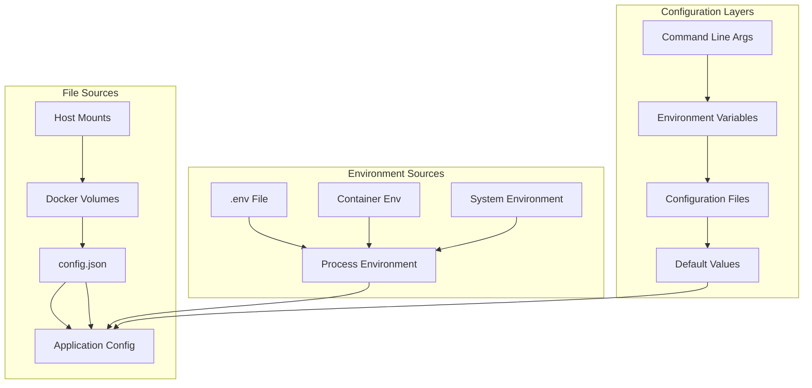
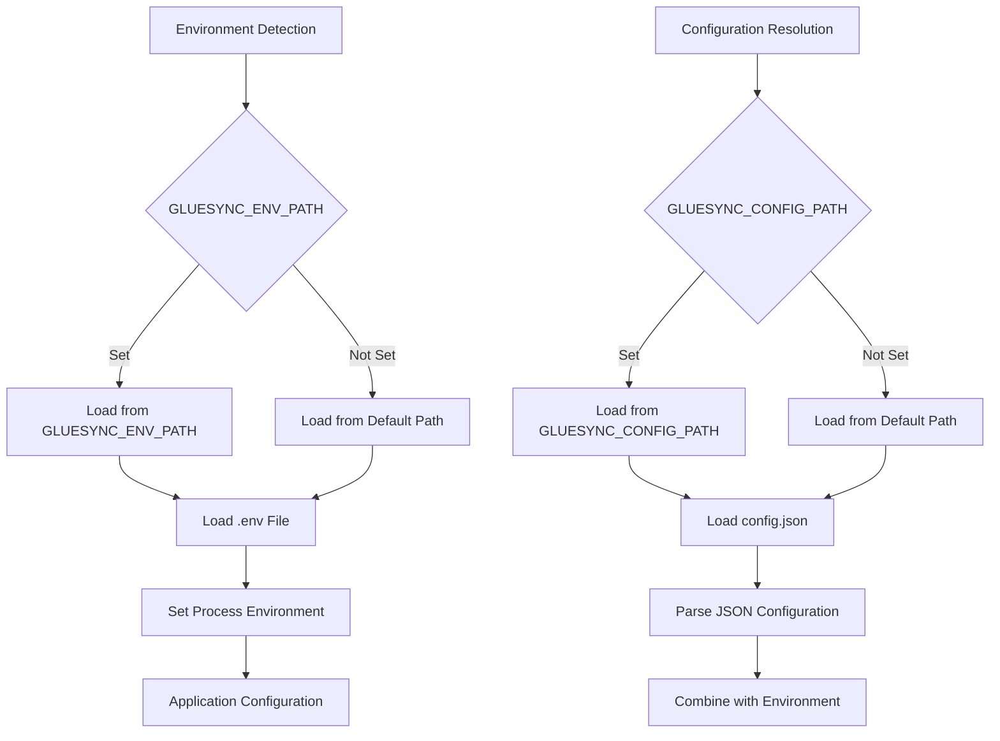
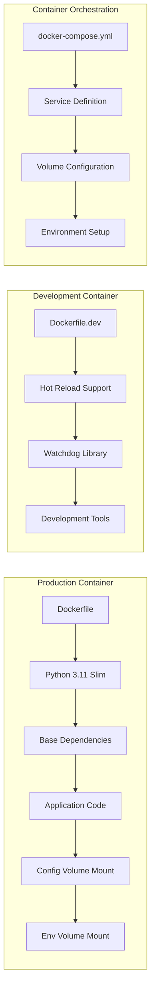
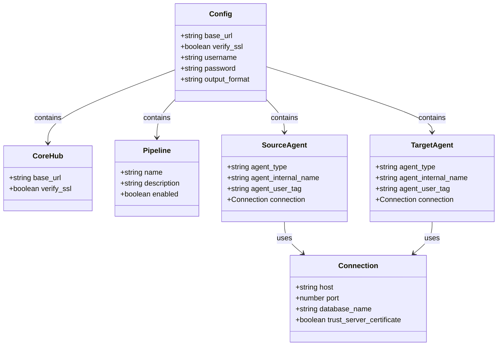
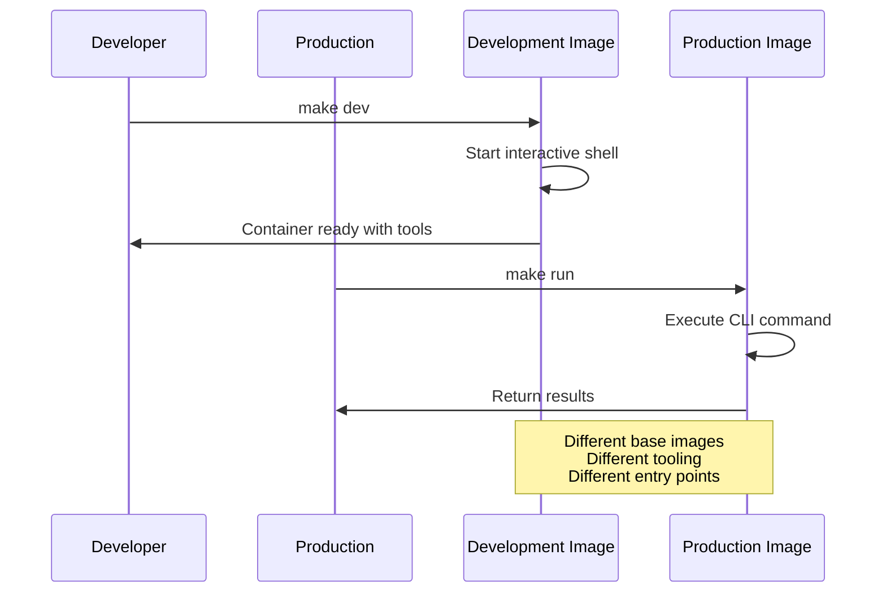
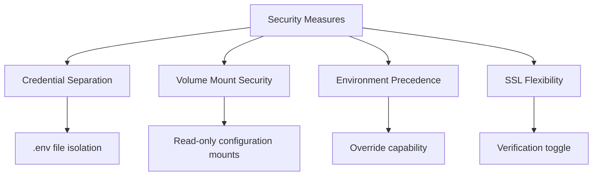

# Configuration and Environment Management

<cite>
**Referenced Files in This Document**
- [config.json](file://config.json)
- [requirements.txt](file://requirements.txt)
- [Dockerfile](file://Dockerfile)
- [docker-compose.yml](file://docker-compose.yml)
- [gluesync_cli.py](file://gluesync_cli.py)
- [gluesync_cli_v2.py](file://gluesync_cli_v2.py)
- [Makefile](file://Makefile)
- [Dockerfile.dev](file://Dockerfile.dev)
- [systemd/gluesync-traefik-proxy.service](file://systemd/gluesync-traefik-proxy.service)
- [scripts/tcp-proxy.py](file://scripts/tcp-proxy.py)
- [README.md](file://README.md)
</cite>

## Table of Contents
1. [Introduction](#introduction)
2. [Configuration Architecture](#configuration-architecture)
3. [Environment Management](#environment-management)
4. [Container Configuration](#container-configuration)
5. [File-Based Configuration](#file-based-configuration)
6. [Environment Variables](#environment-variables)
7. [Volume Mounting Strategy](#volume-mounting-strategy)
8. [Development vs Production](#development-vs-production)
9. [Security Considerations](#security-considerations)
10. [Troubleshooting Configuration Issues](#troubleshooting-configuration-issues)
11. [Best Practices](#best-practices)

## Introduction

This document provides comprehensive coverage of the configuration and environment management system for the GlueSync CLI tool. The project implements a robust multi-layered configuration approach that combines file-based configuration, environment variables, container orchestration, and development/production separation. The system supports both Docker and Podman container runtimes while maintaining security best practices through externalized credential management.

## Configuration Architecture

The GlueSync CLI employs a hierarchical configuration system that prioritizes flexibility and security:



**Diagram sources**
- [gluesync_cli.py:297-334](file://gluesync_cli.py#L297-L334)
- [Dockerfile:24-27](file://Dockerfile#L24-L27)

The configuration system follows a strict precedence order: command-line arguments override environment variables, which override configuration files, which override built-in defaults. This ensures maximum flexibility while maintaining predictable behavior.

**Section sources**
- [gluesync_cli.py:297-334](file://gluesync_cli.py#L297-L334)
- [gluesync_cli.py:717-727](file://gluesync_cli.py#L717-L727)

## Environment Management

The environment management system separates sensitive credentials from configuration data through dedicated files and environment variables:



**Diagram sources**
- [gluesync_cli.py:297-334](file://gluesync_cli.py#L297-L334)

The system implements automatic environment detection with fallback mechanisms, ensuring reliable operation across different deployment scenarios.

**Section sources**
- [gluesync_cli.py:313-324](file://gluesync_cli.py#L313-L324)
- [Dockerfile:30-35](file://Dockerfile#L30-L35)

## Container Configuration

The container configuration system provides both production and development environments with distinct characteristics:



**Diagram sources**
- [Dockerfile:1-40](file://Dockerfile#L1-L40)
- [Dockerfile.dev:1-24](file://Dockerfile.dev#L1-L24)
- [docker-compose.yml:1-52](file://docker-compose.yml#L1-L52)

The production container uses a slim Python base image optimized for security and minimal attack surface, while the development container includes additional tools for hot reloading and debugging.

**Section sources**
- [Dockerfile:1-40](file://Dockerfile#L1-L40)
- [Dockerfile.dev:1-24](file://Dockerfile.dev#L1-L24)
- [docker-compose.yml:1-52](file://docker-compose.yml#L1-L52)

## File-Based Configuration

The file-based configuration system centers around the `config.json` file that contains non-sensitive application settings:



**Diagram sources**
- [config.json:1-34](file://config.json#L1-L34)
- [gluesync_cli.py:37-45](file://gluesync_cli.py#L37-L45)

The configuration structure supports both source and target agents with their respective connection parameters, enabling flexible pipeline configurations.

**Section sources**
- [config.json:1-34](file://config.json#L1-L34)
- [gluesync_cli.py:37-45](file://gluesync_cli.py#L37-L45)

## Environment Variables

The environment variable system provides secure credential management through externalized configuration:

| Variable | Description | Required | Default Value |
|----------|-------------|----------|---------------|
| `GLUESYNC_ADMIN_USERNAME` | Core Hub administrative username | Yes | "admin" |
| `GLUESYNC_ADMIN_PASSWORD` | Core Hub administrative password | Yes | (required) |
| `GLUESYNC_CONFIG_PATH` | Path to configuration JSON file | No | "./config.json" |
| `GLUESYNC_ENV_PATH` | Path to environment file | No | "./.env" |
| `PYTHONUNBUFFERED` | Python output buffering control | No | "1" |

The environment variables support both containerized and standalone execution modes, with automatic detection mechanisms for different deployment scenarios.

**Section sources**
- [gluesync_cli.py:328-334](file://gluesync_cli.py#L328-L334)
- [Dockerfile:24-27](file://Dockerfile#L24-L27)

## Volume Mounting Strategy

The volume mounting strategy ensures proper separation of concerns between configuration data and runtime artifacts:

```mermaid
graph TB
subgraph "Host System"
A[config.json] --> B[Mounted to Container]
C[.env] --> D[Mounted to Container]
E[data/] --> F[Mounted to Container]
G[scripts/] --> H[Mounted to Container]
end
subgraph "Container Filesystem"
B --> I[/app/config/config.json]
D --> J[/app/config/.env]
F --> K[/app/data]
H --> L[/app/scripts]
end
subgraph "Mount Options"
M[Read-Only] --> B
M --> D
N[Read-Write] --> F
O[Read-Only] --> H
end
```

**Diagram sources**
- [docker-compose.yml:10-17](file://docker-compose.yml#L10-L17)
- [Makefile:34-55](file://Makefile#L34-L55)

The mounting strategy provides read-only access to configuration files while allowing write access to the data directory for export/import operations.

**Section sources**
- [docker-compose.yml:10-17](file://docker-compose.yml#L10-L17)
- [Makefile:34-55](file://Makefile#L34-L55)

## Development vs Production

The system provides distinct configurations for development and production environments:



**Diagram sources**
- [Makefile:67-70](file://Makefile#L67-L70)
- [Makefile:33-39](file://Makefile#L33-L39)

The development environment includes hot reload capabilities and development tools, while the production environment focuses on security and minimal footprint.

**Section sources**
- [Makefile:29-31](file://Makefile#L29-L31)
- [Makefile:67-70](file://Makefile#L67-L70)

## Security Considerations

The configuration system implements several security measures to protect sensitive information:

1. **Externalized Credentials**: Passwords and secrets are stored in separate `.env` files outside version control
2. **Volume Mount Security**: Configuration files use read-only mounts to prevent accidental modification
3. **Environment Variable Precedence**: Command-line arguments can override environment variables for dynamic configuration
4. **SSL Verification Control**: Flexible SSL certificate verification settings for different environments



**Section sources**
- [README.md:216-233](file://README.md#L216-L233)
- [gluesync_cli.py:54](file://gluesync_cli.py#L54)

## Troubleshooting Configuration Issues

Common configuration problems and their solutions:

### Configuration File Issues
- **Problem**: Configuration file not found
- **Solution**: Verify `GLUESYNC_CONFIG_PATH` environment variable or use default location
- **Validation**: Use `make verify` to check configuration validity

### Environment Variable Problems
- **Problem**: Missing required environment variables
- **Solution**: Ensure `GLUESYNC_ADMIN_USERNAME` and `GLUESYNC_ADMIN_PASSWORD` are set
- **Debugging**: Check container environment with `env` command

### Volume Mount Issues
- **Problem**: Configuration files not accessible in container
- **Solution**: Verify volume mount syntax and file permissions
- **Validation**: Test with `docker inspect` or `podman inspect`

**Section sources**
- [Makefile:98-104](file://Makefile#L98-L104)
- [Dockerfile:30-35](file://Dockerfile#L30-L35)

## Best Practices

### Configuration Management
1. **Separate Concerns**: Keep sensitive credentials in `.env` and non-sensitive settings in `config.json`
2. **Environment-Specific**: Use different configuration files for development, staging, and production
3. **Version Control**: Add `.env` to `.gitignore` to prevent credential exposure

### Container Deployment
1. **Volume Permissions**: Ensure proper file permissions for mounted volumes
2. **Health Checks**: Implement container health checks for monitoring
3. **Resource Limits**: Set appropriate CPU and memory limits for production containers

### Security Hardening
1. **Least Privilege**: Run containers with minimal required permissions
2. **Network Isolation**: Use dedicated networks for container communication
3. **Secret Rotation**: Implement regular credential rotation procedures

**Section sources**
- [README.md:161-179](file://README.md#L161-L179)
- [Dockerfile:24-27](file://Dockerfile#L24-L27)