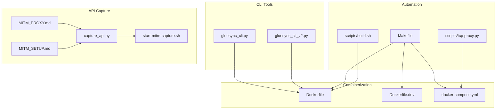
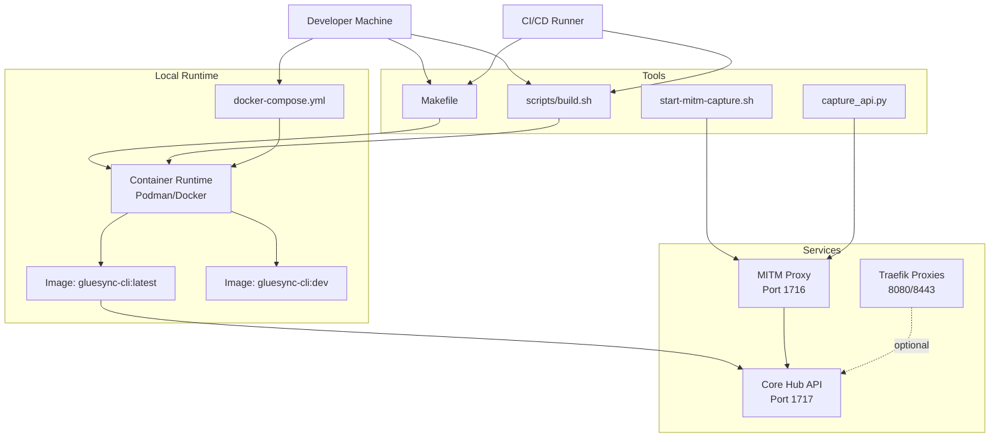
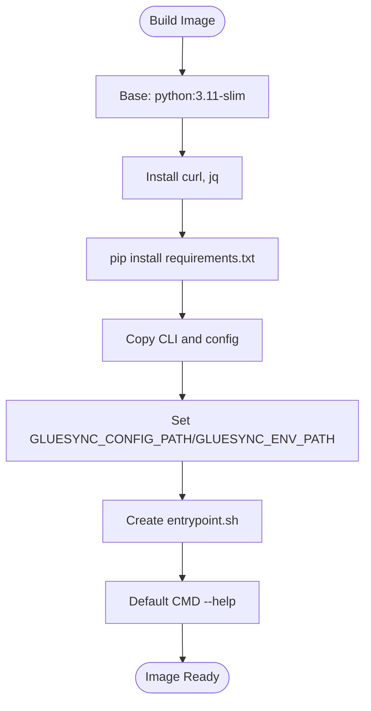
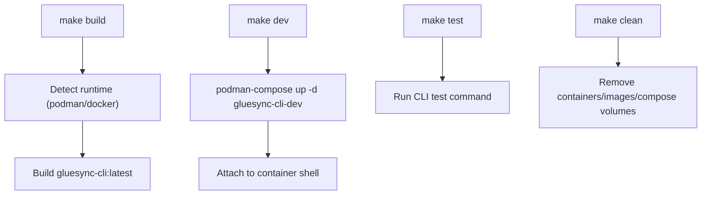
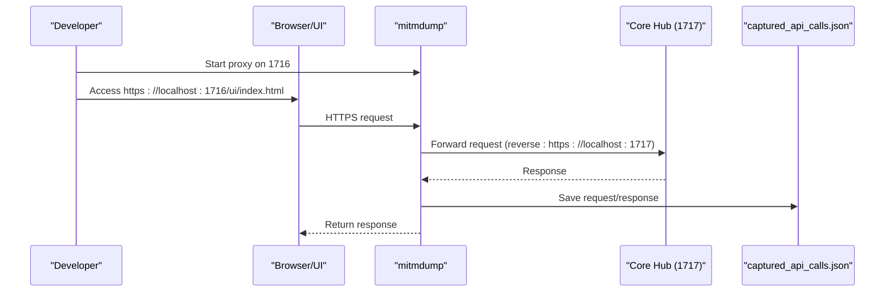
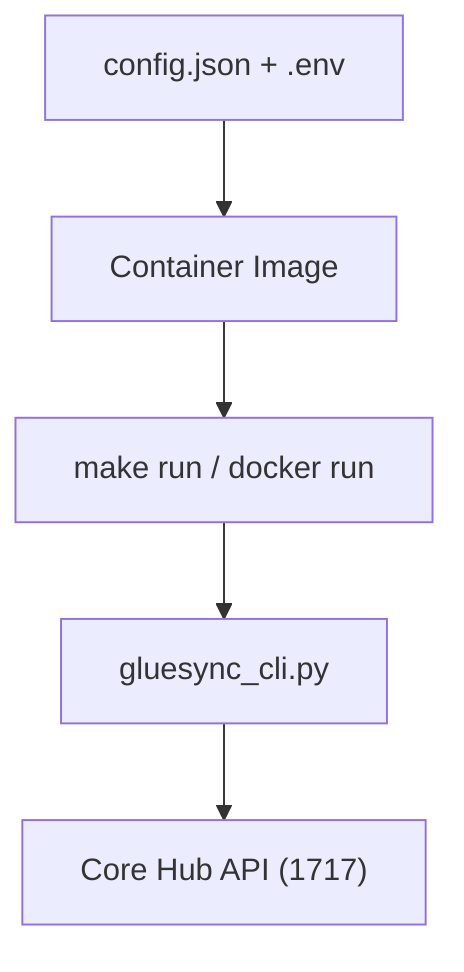
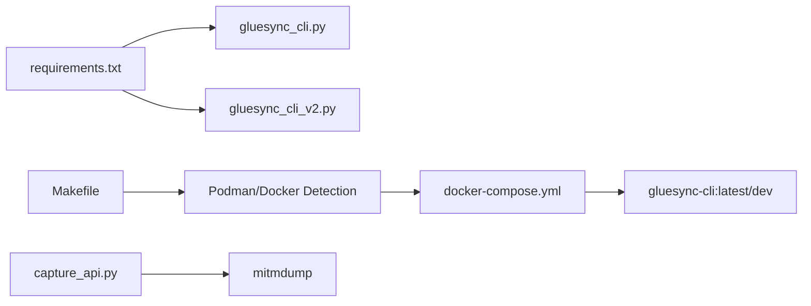

# Development and Testing Infrastructure

<cite>
**Referenced Files in This Document**
- [README.md](file://README.md)
- [Dockerfile](file://Dockerfile)
- [Dockerfile.dev](file://Dockerfile.dev)
- [docker-compose.yml](file://docker-compose.yml)
- [Makefile](file://Makefile)
- [requirements.txt](file://requirements.txt)
- [scripts/build.sh](file://scripts/build.sh)
- [scripts/tcp-proxy.py](file://scripts/tcp-proxy.py)
- [MITM_PROXY.md](file://MITM_PROXY.md)
- [MITM_SETUP.md](file://MITM_SETUP.md)
- [AUTOMATOR_SETUP.md](file://AUTOMATOR_SETUP.md)
- [capture_api.py](file://capture_api.py)
- [start-mitm-capture.sh](file://start-mitm-capture.sh)
- [gluesync_cli.py](file://gluesync_cli.py)
- [gluesync_cli_v2.py](file://gluesync_cli_v2.py)
</cite>

## Table of Contents
1. [Introduction](#introduction)
2. [Project Structure](#project-structure)
3. [Core Components](#core-components)
4. [Architecture Overview](#architecture-overview)
5. [Detailed Component Analysis](#detailed-component-analysis)
6. [Dependency Analysis](#dependency-analysis)
7. [Performance Considerations](#performance-considerations)
8. [Troubleshooting Guide](#troubleshooting-guide)
9. [Conclusion](#conclusion)

## Introduction
This document describes the development and testing infrastructure for the GlueSync CLI project. It covers containerization, build automation, environment configuration, and API capture/testing tools used during development and reverse engineering. The focus is on helping developers set up repeatable builds, run the CLI inside containers, and capture API traffic for automation and debugging.

## Project Structure
The repository organizes development and testing assets around three pillars:
- Containerization: Dockerfiles and docker-compose for production and development environments
- Build automation: Makefile and shell scripts for building, running, and testing
- API capture and reverse engineering: MITM proxy setup and capture scripts for discovering and validating API behavior

**Diagram sources**
- [gluesync_cli.py](file://gluesync_cli.py)
- [gluesync_cli_v2.py](file://gluesync_cli_v2.py)
- [Dockerfile](file://Dockerfile)
- [Dockerfile.dev](file://Dockerfile.dev)
- [docker-compose.yml](file://docker-compose.yml)
- [Makefile](file://Makefile)
- [scripts/build.sh](file://scripts/build.sh)
- [scripts/tcp-proxy.py](file://scripts/tcp-proxy.py)
- [MITM_PROXY.md](file://MITM_PROXY.md)
- [MITM_SETUP.md](file://MITM_SETUP.md)
- [capture_api.py](file://capture_api.py)
- [start-mitm-capture.sh](file://start-mitm-capture.sh)

**Section sources**
- [README.md](file://README.md)
- [Dockerfile](file://Dockerfile)
- [Dockerfile.dev](file://Dockerfile.dev)
- [docker-compose.yml](file://docker-compose.yml)
- [Makefile](file://Makefile)
- [scripts/build.sh](file://scripts/build.sh)
- [scripts/tcp-proxy.py](file://scripts/tcp-proxy.py)
- [MITM_PROXY.md](file://MITM_PROXY.md)
- [MITM_SETUP.md](file://MITM_SETUP.md)
- [capture_api.py](file://capture_api.py)
- [start-mitm-capture.sh](file://start-mitm-capture.sh)

## Core Components
- CLI v1: A full-featured CLI with subcommands for pipelines, agents, entities, and discovery, plus output formatting.
- CLI v2: A compact, kubectl-style CLI focused on get operations for quick queries.
- Container images: Production image (Dockerfile) and development image (Dockerfile.dev) with hot-reload capabilities.
- Compose orchestration: docker-compose.yml defines services for CLI and optional dev mode.
- Build automation: Makefile wraps container runtime detection, build, run, test, and cleanup tasks.
- API capture: MITM proxy setup and capture scripts for reverse engineering and validating API behavior.

**Section sources**
- [gluesync_cli.py](file://gluesync_cli.py)
- [gluesync_cli_v2.py](file://gluesync_cli_v2.py)
- [Dockerfile](file://Dockerfile)
- [Dockerfile.dev](file://Dockerfile.dev)
- [docker-compose.yml](file://docker-compose.yml)
- [Makefile](file://Makefile)
- [MITM_PROXY.md](file://MITM_PROXY.md)
- [MITM_SETUP.md](file://MITM_SETUP.md)
- [capture_api.py](file://capture_api.py)
- [start-mitm-capture.sh](file://start-mitm-capture.sh)

## Architecture Overview
The development and testing architecture centers on containerized execution of the CLI against the GlueSync Core Hub, with optional MITM proxy capture for API discovery and validation.

**Diagram sources**
- [Makefile](file://Makefile)
- [scripts/build.sh](file://scripts/build.sh)
- [docker-compose.yml](file://docker-compose.yml)
- [Dockerfile](file://Dockerfile)
- [Dockerfile.dev](file://Dockerfile.dev)
- [MITM_PROXY.md](file://MITM_PROXY.md)
- [MITM_SETUP.md](file://MITM_SETUP.md)
- [capture_api.py](file://capture_api.py)
- [start-mitm-capture.sh](file://start-mitm-capture.sh)

## Detailed Component Analysis

### Containerization and Orchestration
- Production image (Dockerfile): Installs Python dependencies, copies CLI and config, sets environment variables, and defines an entrypoint that validates the presence of the .env file.
- Development image (Dockerfile.dev): Adds inotify-tools and watchdog for hot-reload scenarios, useful for iterative development.
- Compose (docker-compose.yml): Defines gluesync-cli and optional gluesync-cli-dev services, mounts config and data directories, and exposes a bridge network for inter-service communication.

**Diagram sources**
- [Dockerfile](file://Dockerfile)
- [requirements.txt](file://requirements.txt)

**Section sources**
- [Dockerfile](file://Dockerfile)
- [Dockerfile.dev](file://Dockerfile.dev)
- [docker-compose.yml](file://docker-compose.yml)

### Build Automation with Makefile
- Runtime detection: Automatically selects Podman or Docker based on availability.
- Targets: build, build-dev, run, exec, shell, up, down, logs, dev, test, install, clean, verify, status.
- Development mode: Uses docker-compose profile dev to start gluesync-cli-dev with mounted project directory and interactive shell.

**Diagram sources**
- [Makefile](file://Makefile)
- [docker-compose.yml](file://docker-compose.yml)

**Section sources**
- [Makefile](file://Makefile)
- [docker-compose.yml](file://docker-compose.yml)

### Development Environment and Hot Reload
- Development image adds inotify-tools and watchdog to enable file change monitoring.
- docker-compose profile dev mounts the project directory into the dev container for live iteration.
- The dev container defaults to bash for interactive sessions.

**Section sources**
- [Dockerfile.dev](file://Dockerfile.dev)
- [docker-compose.yml](file://docker-compose.yml)

### API Capture and Reverse Engineering
- MITM Proxy: A reverse proxy captures HTTPS traffic between the browser/UI and Core Hub, saving structured logs for analysis.
- Capture script: Filters API calls (pipelines, authentication, agents, api) and writes request/response bodies to a JSON file.
- Start script: Validates prerequisites (Core Hub on 1717, port 1716 free), clears previous capture, and launches mitmdump with the capture addon.

**Diagram sources**
- [MITM_PROXY.md](file://MITM_PROXY.md)
- [MITM_SETUP.md](file://MITM_SETUP.md)
- [capture_api.py](file://capture_api.py)
- [start-mitm-capture.sh](file://start-mitm-capture.sh)

**Section sources**
- [MITM_PROXY.md](file://MITM_PROXY.md)
- [MITM_SETUP.md](file://MITM_SETUP.md)
- [capture_api.py](file://capture_api.py)
- [start-mitm-capture.sh](file://start-mitm-capture.sh)

### CLI Integration with Containerized Environment
- The CLI supports environment-driven configuration and can run inside containers with mounted config and credentials.
- The Makefile and scripts demonstrate how to run CLI commands against the Core Hub using the container image.

**Diagram sources**
- [Makefile](file://Makefile)
- [Dockerfile](file://Dockerfile)
- [gluesync_cli.py](file://gluesync_cli.py)

**Section sources**
- [Makefile](file://Makefile)
- [Dockerfile](file://Dockerfile)
- [gluesync_cli.py](file://gluesync_cli.py)

### TCP Port Forwarding Utility
- A simple TCP proxy forwards traffic from a local port to a target host/port, useful for exposing services behind Traefik or other proxies locally.

**Section sources**
- [scripts/tcp-proxy.py](file://scripts/tcp-proxy.py)

## Dependency Analysis
- Python dependencies: requests and python-dotenv are required for the CLI to communicate with the API and load environment variables.
- Container runtime: The project supports both Podman and Docker, with automatic detection in scripts and Makefile.
- Compose profiles: Development mode uses a separate service and profile to isolate dev-specific mounts and tools.

**Diagram sources**
- [requirements.txt](file://requirements.txt)
- [Makefile](file://Makefile)
- [docker-compose.yml](file://docker-compose.yml)
- [gluesync_cli.py](file://gluesync_cli.py)
- [gluesync_cli_v2.py](file://gluesync_cli_v2.py)
- [capture_api.py](file://capture_api.py)

**Section sources**
- [requirements.txt](file://requirements.txt)
- [Makefile](file://Makefile)
- [docker-compose.yml](file://docker-compose.yml)
- [gluesync_cli.py](file://gluesync_cli.py)
- [gluesync_cli_v2.py](file://gluesync_cli_v2.py)
- [capture_api.py](file://capture_api.py)

## Performance Considerations
- Containerized execution avoids local Python environment drift and ensures consistent dependency versions.
- MITM capture introduces overhead due to SSL interception and logging; use it selectively for reverse engineering and debugging.
- For bulk operations or frequent CLI runs, prefer direct Core Hub access (port 1717) and reserve MITM capture (port 1716) for targeted investigations.

## Troubleshooting Guide
- Port conflicts:
  - MITM proxy port 1716 already in use: identify and terminate the conflicting process, or choose a different port.
  - Core Hub port 1717 already in use: stop the existing container/service before starting the Core Hub.
- SSL certificate warnings:
  - Accept the certificate in the browser or install the mitmproxy CA certificate to avoid warnings.
- Missing credentials or config:
  - Ensure .env and config.json are present and mounted into the container; the entrypoint warns if .env is missing.
- Container runtime detection:
  - If neither Podman nor Docker is detected, install one of them or adjust PATH accordingly.

**Section sources**
- [MITM_PROXY.md](file://MITM_PROXY.md)
- [MITM_SETUP.md](file://MITM_SETUP.md)
- [Dockerfile](file://Dockerfile)
- [Makefile](file://Makefile)

## Conclusion
The GlueSync CLI project provides a robust development and testing infrastructure centered on containerization, automated build and run targets, and a practical MITM proxy setup for API capture and reverse engineering. By leveraging the provided Dockerfiles, docker-compose configuration, Makefile targets, and capture tools, developers can reliably build, iterate, and validate CLI operations against the Core Hub while maintaining secure and isolated environments.