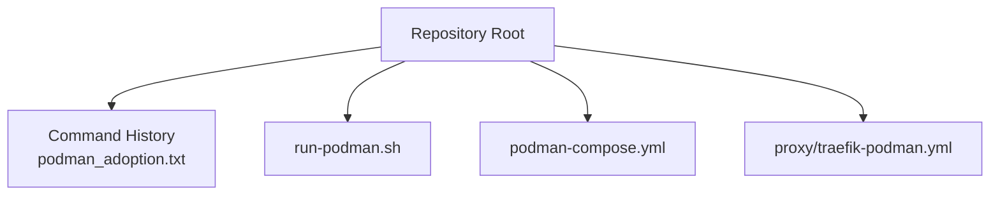
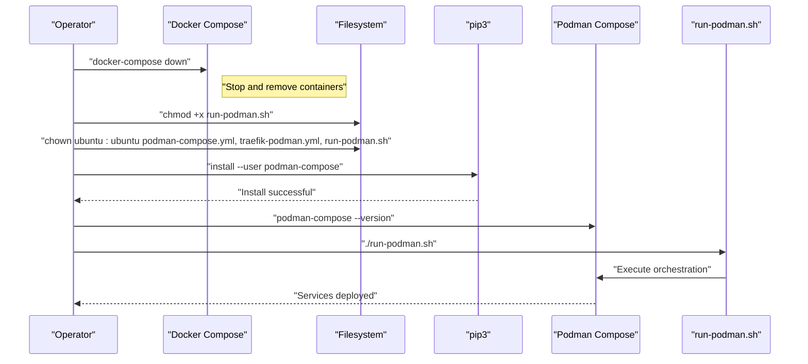
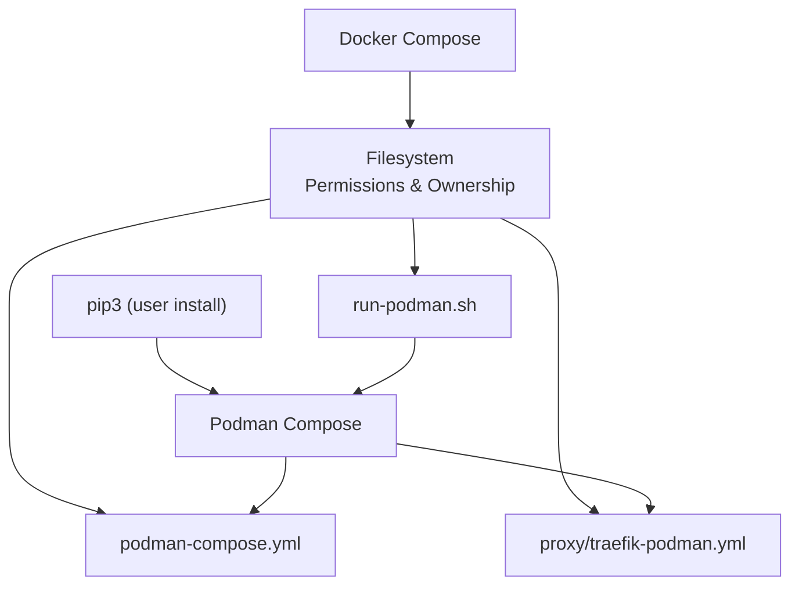

# Migration Process

<cite>
**Referenced Files in This Document**
- [podman_adoption.txt](file://podman_adoption.txt)
</cite>

## Table of Contents
1. [Introduction](#introduction)
2. [Project Structure](#project-structure)
3. [Core Components](#core-components)
4. [Architecture Overview](#architecture-overview)
5. [Detailed Component Analysis](#detailed-component-analysis)
6. [Dependency Analysis](#dependency-analysis)
7. [Performance Considerations](#performance-considerations)
8. [Troubleshooting Guide](#troubleshooting-guide)
9. [Conclusion](#conclusion)

## Introduction
This document explains the end-to-end migration from Docker Compose to Podman Compose, based on the recorded command history. It covers the operational sequence from shutting down existing Docker services, preparing configuration files and scripts, installing Podman Compose, and launching services under Podman. It also highlights the technical differences between Docker Compose and Podman Compose that drive this migration and provides practical guidance for permissions, ownership, and common pitfalls.

## Project Structure
The repository snapshot contains a single file that documents the migration steps and commands executed during the process. The commands indicate a typical project layout with:
- A shell script used to orchestrate Podman-based deployments
- YAML configuration files for container orchestration and reverse proxy configuration
- A working directory containing the deployment assets

**Diagram sources**
- [podman_adoption.txt:1-16](file://podman_adoption.txt#L1-L16)

**Section sources**
- [podman_adoption.txt:1-16](file://podman_adoption.txt#L1-L16)

## Core Components
This section outlines the essential components involved in the migration and their roles:
- Docker Compose: Existing orchestration used to stop services prior to migration
- Podman Compose: Replacement orchestration tool installed locally via Python package manager
- Shell script: Wrapper that executes Podman Compose commands to deploy services
- Configuration files: Orchestration and reverse proxy configurations for the new runtime

Key observations from the command history:
- Services are stopped using Docker Compose before switching to Podman
- Ownership and permissions are set on configuration and script files
- Podman Compose is installed via pip3 with user scope and PATH updated accordingly
- The deployment is initiated by invoking the shell script

**Section sources**
- [podman_adoption.txt:1-16](file://podman_adoption.txt#L1-L16)

## Architecture Overview
The migration workflow follows a linear progression: stop Docker services, prepare files, install Podman Compose, and launch services under Podman. The diagram below maps the documented steps to the actual command history.

**Diagram sources**
- [podman_adoption.txt:1-16](file://podman_adoption.txt#L1-L16)

## Detailed Component Analysis

### Step 1: Stop Docker Services
- Purpose: Safely terminate existing containers managed by Docker Compose before migrating to Podman.
- Command: Invoked via the documented history.
- Outcome: Ensures clean state for subsequent Podman deployment.

**Section sources**
- [podman_adoption.txt:5](file://podman_adoption.txt#L5)

### Step 2: Prepare Files and Permissions
- Purpose: Ensure the deployment script and configuration files are executable and owned by the operator.
- Actions:
  - Make the shell script executable
  - Set ownership to the operator’s user and group
- Impact: Prevents permission-related failures during Podman Compose execution.

**Section sources**
- [podman_adoption.txt:1-2](file://podman_adoption.txt#L1-L2)

### Step 3: Install Podman Compose
- Purpose: Replace Docker Compose orchestration with Podman Compose.
- Observation: The distribution package for Podman Compose was not available, so the operator used a local installation via pip3 with user scope.
- Steps:
  - Update package index
  - Install Python package manager if missing
  - Install Podman Compose for the current user
  - Add user-local bin directory to PATH
  - Verify installation

**Section sources**
- [podman_adoption.txt:8-15](file://podman_adoption.txt#L8-L15)

### Step 4: Launch Services Under Podman
- Purpose: Deploy services using Podman Compose with the prepared configuration files.
- Actions:
  - Execute the wrapper script to orchestrate deployment
  - Validate the installed version of Podman Compose

**Section sources**
- [podman_adoption.txt:6-7](file://podman_adoption.txt#L6-L7)
- [podman_adoption.txt:15](file://podman_adoption.txt#L15)

### Configuration Files and Scripts
- podman-compose.yml: Orchestration configuration for services
- proxy/traefik-podman.yml: Reverse proxy configuration for the environment
- run-podman.sh: Deployment script orchestrating Podman Compose

Ownership and permissions are explicitly set for these files to ensure reliable execution under the operator’s account.

**Section sources**
- [podman_adoption.txt:1-2](file://podman_adoption.txt#L1-L2)

## Dependency Analysis
The migration introduces a new dependency chain:
- Local Python environment for user-scoped package installation
- Podman Compose CLI for orchestration
- Shell script wrapper for deployment automation
- Configuration files for service definition and proxy routing

**Diagram sources**
- [podman_adoption.txt:1-16](file://podman_adoption.txt#L1-L16)

**Section sources**
- [podman_adoption.txt:1-16](file://podman_adoption.txt#L1-L16)

## Performance Considerations
- Podman Compose runs without a persistent daemon, which can reduce resource overhead compared to Docker’s client-server model.
- Local user installation avoids system-wide changes and potential conflicts with existing Docker environments.
- Proper file permissions and ownership minimize runtime errors and retries.

[No sources needed since this section provides general guidance]

## Troubleshooting Guide
Common issues and resolutions during migration:

- Distribution package unavailable:
  - Symptom: Attempted installation via the system package manager fails.
  - Resolution: Use user-scoped installation via pip3 and update PATH to include the user bin directory.

- Permission denied errors:
  - Symptom: Failure to execute the deployment script or read configuration files.
  - Resolution: Ensure the script and configuration files are owned by the operator and have executable permissions.

- PATH not updated:
  - Symptom: Command not found after installation.
  - Resolution: Add the user-local bin directory to PATH and reload the shell configuration.

- Version verification:
  - Symptom: Uncertainty about successful installation.
  - Resolution: Confirm the installed version using the tool’s version flag.

**Section sources**
- [podman_adoption.txt:8-15](file://podman_adoption.txt#L8-L15)

## Conclusion
The migration from Docker Compose to Podman Compose involves stopping existing services, preparing configuration files and scripts with correct ownership and permissions, installing Podman Compose via pip3, and launching services through the provided shell script. The recorded history demonstrates a pragmatic approach to handle unavailability of the distribution package for Podman Compose and ensures a smooth transition to a daemonless orchestration model.