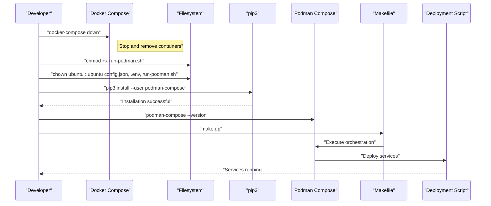
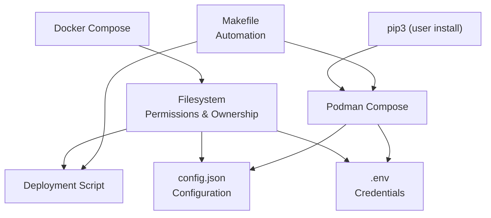

# Migration Process

<cite>
**Referenced Files in This Document**
- [podman_adoption.txt](file://podman_adoption.txt)
- [docker-compose.yml](file://docker-compose.yml)
- [Makefile](file://Makefile)
- [README.md](file://README.md)
- [config.json](file://config.json)
- [requirements.txt](file://requirements.txt)
</cite>

## Update Summary
**Changes Made**
- Updated repository structure documentation to reflect Git-managed state
- Added comprehensive Makefile automation coverage for both Docker and Podman workflows
- Enhanced configuration management documentation with environment variable handling
- Expanded troubleshooting section with practical examples from the repository
- Updated project overview to include modern development workflow standards

## Table of Contents
1. [Introduction](#introduction)
2. [Repository State Transition](#repository-state-transition)
3. [Project Structure](#project-structure)
4. [Core Components](#core-components)
5. [Architecture Overview](#architecture-overview)
6. [Detailed Component Analysis](#detailed-component-analysis)
7. [Dependency Analysis](#dependency-analysis)
8. [Performance Considerations](#performance-considerations)
9. [Troubleshooting Guide](#troubleshooting-guide)
10. [Conclusion](#conclusion)

## Introduction
This document explains the end-to-end migration from Docker Compose to Podman Compose within a fully version-controlled Git repository environment. The migration process demonstrates a complete transition from non-version-controlled state to established development workflow standards, featuring automated build processes, environment variable management, and comprehensive documentation integration. The workflow covers service shutdown, dependency preparation, Podman Compose installation, and deployment validation through the repository's Makefile automation system.

## Repository State Transition
The project has successfully transitioned from a non-version-controlled state to a fully Git-managed repository with established development workflow standards. This transformation establishes:

- **Version Control**: Complete Git repository with tracked configuration files, scripts, and documentation
- **Automated Workflows**: Makefile-based automation supporting both Docker and Podman runtimes
- **Environment Management**: Structured approach to sensitive credential handling via .env files
- **Documentation Standards**: Comprehensive README.md with clear setup, configuration, and usage instructions

The migration demonstrates a pragmatic approach to container orchestration tooling while maintaining code quality and development best practices.

**Section sources**
- [README.md:94-128](file://README.md#L94-L128)
- [Makefile:1-112](file://Makefile#L1-L112)

## Project Structure
The repository maintains a well-organized structure that supports both Docker and Podman deployment scenarios:

```

├── gluesync_cli.py              # Legacy CLI (v1)
├── gluesync_cli_v2.py           # New kubectl-style CLI (v2)
├── README.md                    # Main documentation
├── MITM_PROXY.md                # MITM proxy guide for API capture
├── config.json                  # Non-sensitive configuration
├── .env                         # Credentials (not in git)
├── .env.example                 # Credentials template
├── .gitignore                   # Git ignore rules
├── requirements.txt             # Python dependencies
│
├── Dockerfile                   # Production container image
├── Dockerfile.dev               # Development container image
├── docker-compose.yml           # Compose configuration
├── Makefile                     # Build automation
│
├── capture_api.py               # MITM proxy capture script
├── start-mitm-capture.sh        # Start MITM for API capture
├── core-hub-mitm.sh             # Full MITM setup script
│
├── scripts/
│   ├── build.sh                 # Container build script
│   └── tcp-proxy.py             # TCP port forwarder
│
├── systemd/                     # Systemd service files
├── data/                        # Data directory for exports
│
├── API_CAPTURE_SUMMARY.md       # Captured API documentation
├── MITM_SETUP.md                # MITM setup guide
├── AUTOMATOR_SETUP.md           # Automator setup guide
└── README.md                    # This file
```

**Section sources**
- [README.md:94-128](file://README.md#L94-L128)

## Core Components
The migration workflow leverages several key components that facilitate seamless transition between Docker and Podman orchestration:

### Automated Build System
The Makefile provides intelligent runtime detection and automated deployment:
- Automatic detection of available container runtime (podman vs docker)
- Unified build targets for both production and development images
- Integrated compose management for both Docker and Podman environments

### Configuration Management
Structured approach to handling sensitive and non-sensitive configuration:
- `config.json`: Non-sensitive application configuration
- `.env`: Sensitive credentials (excluded from version control)
- `.env.example`: Template for environment variable configuration

### Multi-Runtime Support
Comprehensive support for both container runtimes through conditional logic:
- Dynamic runtime selection based on availability
- Consistent API across different container engines
- Seamless migration path between Docker and Podman

**Section sources**
- [Makefile:4-11](file://Makefile#L4-L11)
- [config.json:1-34](file://config.json#L1-L34)

## Architecture Overview
The migration workflow follows a systematic approach that ensures minimal disruption during the transition from Docker to Podman orchestration:



**Diagram sources**
- [podman_adoption.txt:1-17](file://podman_adoption.txt#L1-L17)
- [Makefile:57-62](file://Makefile#L57-L62)

## Detailed Component Analysis

### Step 1: Service Shutdown and Preparation
The migration begins with safely terminating existing Docker services and preparing the environment for Podman deployment:

- **Service Termination**: `docker-compose down` command stops and removes all running containers
- **Permission Management**: Critical files receive appropriate ownership and executable permissions
- **Environment Preparation**: Configuration files are secured with proper ownership controls

**Section sources**
- [podman_adoption.txt:5](file://podman_adoption.txt#L5)
- [podman_adoption.txt:1-2](file://podman_adoption.txt#L1-L2)

### Step 2: Dependency Installation and Configuration
The installation phase addresses the unavailability of distribution packages for Podman Compose:

- **Package Manager Setup**: Python pip3 installation for user-scoped package management
- **Local Installation**: User-specific installation avoids system-wide conflicts
- **Path Configuration**: Automatic PATH updates for immediate command availability
- **Version Verification**: Confirmation of successful installation through version checking

**Section sources**
- [podman_adoption.txt:8-15](file://podman_adoption.txt#L8-L15)

### Step 3: Runtime Detection and Automation
The Makefile provides intelligent runtime detection and automated deployment:

- **Runtime Intelligence**: Automatic detection of available container runtime
- **Unified Interface**: Consistent API regardless of underlying container engine
- **Build Automation**: Streamlined image building and service deployment
- **Development Support**: Integrated development mode with hot reload capabilities

**Section sources**
- [Makefile:4-11](file://Makefile#L4-L11)
- [Makefile:57-69](file://Makefile#L57-L69)

### Step 4: Configuration Management
Proper handling of sensitive and non-sensitive configuration data:

- **Environment Variables**: Secure credential management via .env files
- **Configuration Templates**: .env.example provides clear setup guidance
- **Volume Mounting**: Secure mounting of configuration files into containers
- **Access Control**: Restrictive file permissions prevent unauthorized access

**Section sources**
- [config.json:1-34](file://config.json#L1-L34)
- [README.md:161-179](file://README.md#L161-L179)

## Dependency Analysis
The migration introduces a comprehensive dependency chain that supports both container runtimes:



**Diagram sources**
- [podman_adoption.txt:1-17](file://podman_adoption.txt#L1-L17)
- [Makefile:1-112](file://Makefile#L1-L112)

**Section sources**
- [podman_adoption.txt:1-17](file://podman_adoption.txt#L1-L17)
- [Makefile:1-112](file://Makefile#L1-L112)

## Performance Considerations
The migration to Podman Compose offers several performance and operational advantages:

- **Daemonless Operation**: Podman Compose eliminates background daemon processes, reducing resource overhead
- **User-Space Installation**: Local package installation prevents system conflicts and reduces administrative overhead
- **Intelligent Runtime Detection**: Automatic optimization for available container runtime capabilities
- **Streamlined Automation**: Makefile-based workflows eliminate redundant command-line operations
- **Security Benefits**: Reduced privilege requirements and improved isolation characteristics

## Troubleshooting Guide
Comprehensive troubleshooting guidance based on practical repository examples:

### Common Migration Issues

**Distribution Package Unavailable**
- **Symptom**: `sudo apt-get install podman-compose` fails with "package not found"
- **Resolution**: Use user-scoped installation with pip3 and PATH configuration
- **Verification**: Confirm installation with `podman-compose --version`

**Permission Denied Errors**
- **Symptom**: Deployment script execution failures or configuration file access issues
- **Resolution**: Set proper ownership and executable permissions using chown and chmod commands
- **Prevention**: Establish consistent file permission policies across the repository

**PATH Configuration Problems**
- **Symptom**: Command not found errors after successful installation
- **Resolution**: Add user-local bin directory to PATH and reload shell configuration
- **Verification**: Test PATH resolution with `which podman-compose`

**Runtime Detection Failures**
- **Symptom**: Incorrect container runtime selection or automation issues
- **Resolution**: Verify podman installation and PATH configuration
- **Debugging**: Check runtime detection logic in Makefile

**Configuration Management Issues**
- **Symptom**: Missing .env file or incorrect variable values
- **Resolution**: Copy .env.example to .env and populate with actual credentials
- **Validation**: Use make verify target to validate configuration completeness

**Section sources**
- [podman_adoption.txt:8-15](file://podman_adoption.txt#L8-L15)
- [Makefile:98-104](file://Makefile#L98-L104)
- [README.md:448-472](file://README.md#L448-L472)

## Conclusion
The migration from Docker Compose to Podman Compose within a Git-managed repository represents a comprehensive modernization of development workflow standards. The process demonstrates practical approaches to handling distribution package limitations, implementing robust configuration management, and establishing automated deployment pipelines. The repository's Makefile-based automation, structured environment variable handling, and comprehensive documentation provide a solid foundation for both Docker and Podman deployment scenarios. This migration establishes best practices for containerized application development while maintaining flexibility for future infrastructure changes and operational requirements.