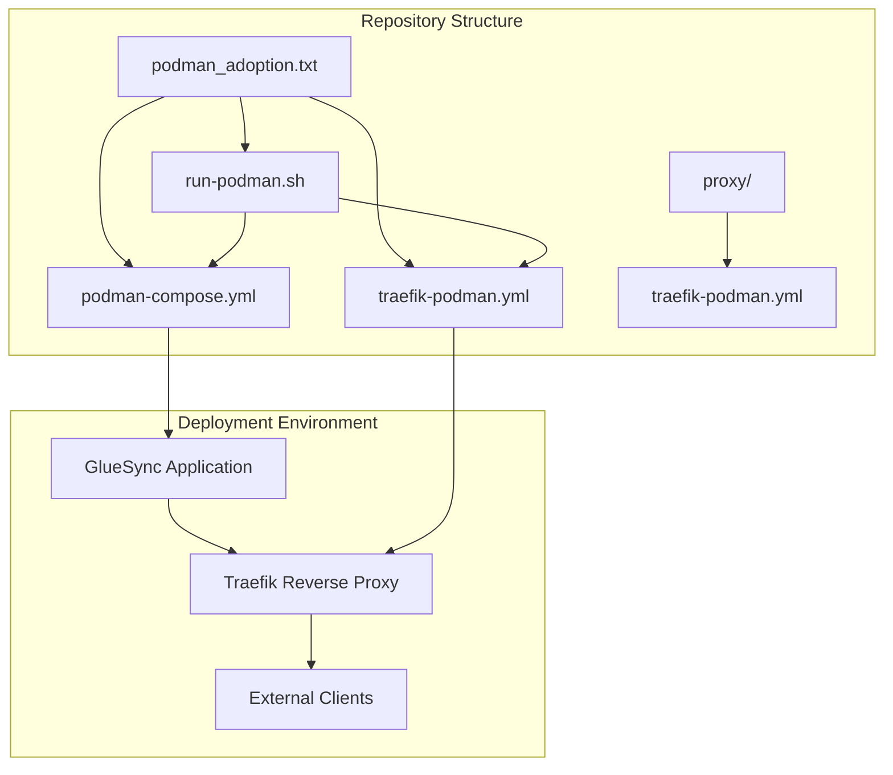
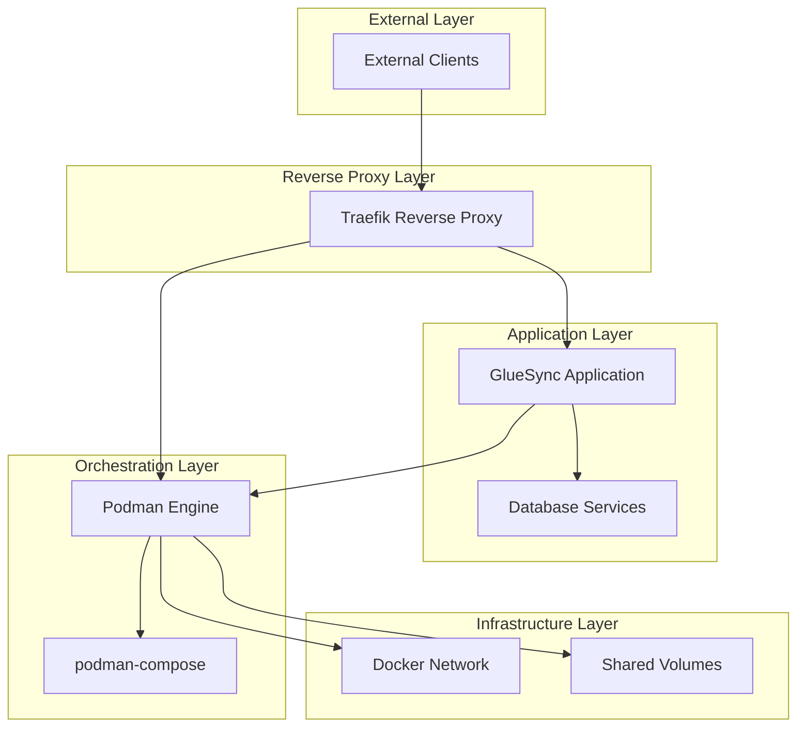
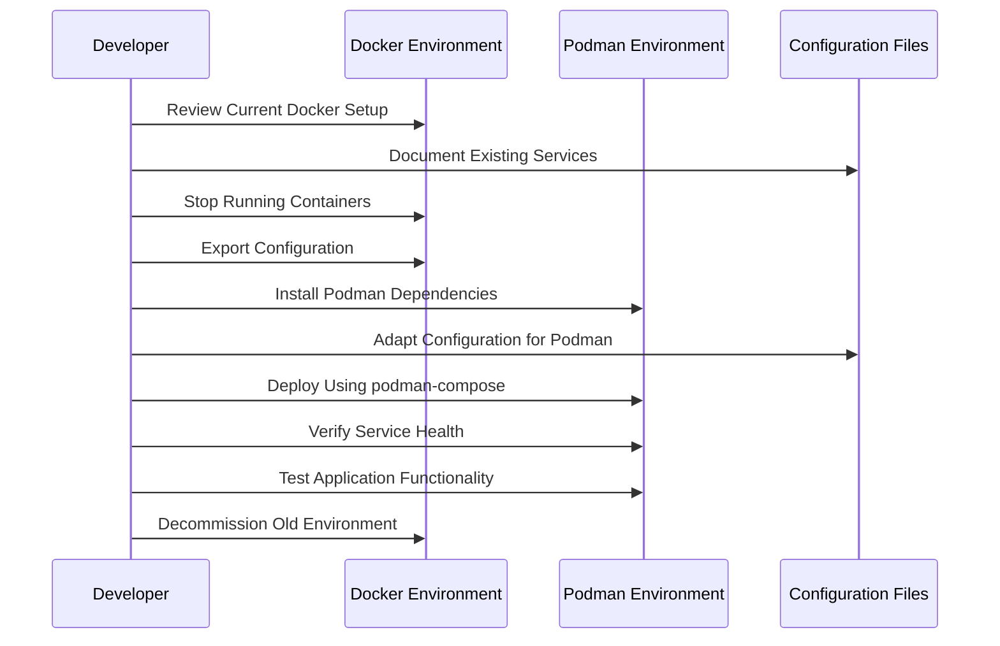

# Project Overview

<cite>
**Referenced Files in This Document**
- [podman_adoption.txt](file://podman_adoption.txt)
</cite>

## Table of Contents
1. [Introduction](#introduction)
2. [Project Structure](#project-structure)
3. [Core Components](#core-components)
4. [Architecture Overview](#architecture-overview)
5. [Detailed Component Analysis](#detailed-component-analysis)
6. [Migration Workflow](#migration-workflow)
7. [Container Orchestration Fundamentals](#container-orchestration-fundamentals)
8. [Benefits of Podman Over Docker](#benefits-of-podman-over-docker)
9. [Practical Implementation Examples](#practical-implementation-examples)
10. [Troubleshooting Guide](#troubleshooting-guide)
11. [Conclusion](#conclusion)

## Introduction

This document provides a comprehensive overview of the Podman adoption project for migrating GlueSync application deployment from Docker to Podman with Traefik reverse proxy integration. The project addresses the growing need for rootless container orchestration solutions that offer enhanced security, improved resource management, and simplified deployment processes.

The migration initiative focuses on modernizing container infrastructure while maintaining application functionality and performance. By transitioning from Docker to Podman, organizations can leverage rootless containerization, improved security posture, and reduced operational overhead.

## Project Structure

The repository contains a single historical record file that documents the migration process and key configuration files. The project structure follows a typical container orchestration deployment pattern:

**Diagram sources**
- [podman_adoption.txt:1-16](file://podman_adoption.txt#L1-L16)

**Section sources**
- [podman_adoption.txt:1-16](file://podman_adoption.txt#L1-L16)

## Core Components

### GlueSync Application Container
The GlueSync application serves as the primary business logic container within the deployment stack. This component handles data synchronization tasks and provides APIs for client interactions.

### Traefik Reverse Proxy
Traefik acts as the ingress controller and load balancer, managing external traffic routing to the GlueSync application containers. It provides automatic service discovery, SSL termination, and health monitoring capabilities.

### Podman Orchestration Layer
The orchestration layer manages container lifecycle operations, networking, and volume management. Podman provides rootless containerization without requiring a daemon process.

### Deployment Scripts
Automated deployment scripts handle environment preparation, dependency installation, and container orchestration commands.

**Section sources**
- [podman_adoption.txt:1-16](file://podman_adoption.txt#L1-L16)

## Architecture Overview

The deployment architecture implements a modern containerized microservices pattern with reverse proxy routing:

**Diagram sources**
- [podman_adoption.txt:1-16](file://podman_adoption.txt#L1-L16)

The architecture demonstrates a clear separation of concerns with Traefik handling external traffic management, GlueSync managing business logic, and Podman providing container orchestration services.

## Detailed Component Analysis

### Traefik Configuration Management
The Traefik configuration utilizes YAML-based declarative configuration for service discovery and routing rules. This approach enables dynamic configuration updates without service restarts.

### Podman Compose Orchestration
The podman-compose configuration defines multi-container deployments with service dependencies, network configurations, and volume mounts. This orchestrator provides Docker-compatible syntax for seamless migration.

### Rootless Container Execution
Podman operates without requiring a system daemon, enabling container execution with user privileges only. This enhances security by eliminating potential attack vectors associated with privileged container management.

**Section sources**
- [podman_adoption.txt:1-16](file://podman_adoption.txt#L1-L16)

## Migration Workflow

The migration from Docker to Podman follows a structured approach ensuring minimal disruption to existing services:

**Diagram sources**
- [podman_adoption.txt:5-15](file://podman_adoption.txt#L5-L15)

### Pre-Migration Phase
- Assessment of current Docker environment and service dependencies
- Backup of configuration files and data volumes
- Testing environment preparation with Podman installation

### Migration Execution Phase
- Configuration adaptation from Docker Compose to podman-compose format
- Dependency resolution for podman-compose installation
- Service deployment verification and health checks

### Post-Migration Validation
- Functional testing of GlueSync application
- Performance benchmarking against Docker implementation
- Documentation update and team training

**Section sources**
- [podman_adoption.txt:5-15](file://podman_adoption.txt#L5-L15)

## Container Orchestration Fundamentals

### Service Discovery and Load Balancing
Container orchestration platforms provide automated service discovery mechanisms that enable dynamic scaling and load distribution. Traefik integrates seamlessly with Podman's container management to provide intelligent traffic routing.

### Resource Management and Scheduling
Modern orchestration systems optimize resource allocation across container instances, ensuring efficient utilization of CPU, memory, and storage resources. This is particularly important for data synchronization applications like GlueSync.

### Health Monitoring and Self-Healing
Orchestration platforms implement comprehensive health monitoring with automatic restart policies and failure recovery mechanisms. This ensures high availability and fault tolerance for mission-critical applications.

### Security and Isolation
Container orchestration enhances security through network isolation, resource quotas, and privilege management. Podman's rootless operation provides additional security benefits by eliminating privileged container management processes.

## Benefits of Podman Over Docker

### Enhanced Security Model
Podman operates without requiring a system daemon, reducing the attack surface and eliminating potential privilege escalation vectors. This rootless architecture provides improved security for containerized applications.

### Simplified Deployment
The absence of a persistent daemon process simplifies deployment and reduces operational complexity. Container lifecycle management becomes more straightforward with direct process execution.

### Improved Resource Efficiency
Podman's lightweight architecture consumes fewer system resources compared to Docker's daemon-based approach. This efficiency gain becomes significant in environments running multiple containerized services.

### Better Integration with Modern Infrastructure
Podman aligns with contemporary container standards and integrates well with systemd-based environments. This compatibility facilitates smoother adoption in modern Linux distributions.

### Reduced Operational Overhead
Without daemon management requirements, administrators face fewer maintenance tasks and potential failure points. This reduction in operational complexity translates to improved reliability and lower support costs.

## Practical Implementation Examples

### Environment Preparation
The migration process begins with environment preparation and dependency installation. The historical record shows the progression from Docker Compose cleanup to Podman dependency installation.

### Configuration Adaptation
Configuration files require adaptation from Docker Compose syntax to podman-compose format. This involves updating service definitions, network configurations, and volume mount specifications.

### Service Deployment
The deployment process involves running automated scripts that handle container orchestration commands and service initialization. Health checks ensure proper service startup and connectivity.

### Monitoring and Validation
Post-deployment validation includes functional testing, performance measurement, and integration verification. This ensures the migrated environment maintains application functionality and performance characteristics.

**Section sources**
- [podman_adoption.txt:5-15](file://podman_adoption.txt#L5-L15)

## Troubleshooting Guide

### Common Migration Issues
- **Dependency Resolution**: Some packages may not be available through standard repositories, requiring manual installation or alternative package managers
- **Permission Issues**: Rootless container execution requires proper user permissions and group membership
- **Network Configuration**: Container networking may require explicit configuration for inter-service communication
- **Volume Mounting**: File system permissions and SELinux contexts may affect volume accessibility

### Diagnostic Commands
- Verify Podman installation and version compatibility
- Check container runtime status and health
- Review container logs for error messages and stack traces
- Validate network connectivity between services
- Confirm proper file system permissions for mounted volumes

### Recovery Procedures
- Rollback to previous Docker environment if critical failures occur
- Restore from backup configurations and data volumes
- Reinstall dependencies and retry deployment
- Validate system requirements and resource availability

**Section sources**
- [podman_adoption.txt:7-15](file://podman_adoption.txt#L7-L15)

## Conclusion

The Podman adoption project represents a strategic modernization of container infrastructure for GlueSync application deployment. By migrating from Docker to Podman, organizations can achieve enhanced security, improved resource efficiency, and simplified operational management.

The successful implementation of this migration depends on careful planning, thorough testing, and comprehensive validation procedures. The documented workflow provides a foundation for systematic deployment while acknowledging the unique challenges and considerations inherent in container orchestration transitions.

Future enhancements may include automated deployment pipelines, enhanced monitoring and alerting, and expanded service mesh integration for improved observability and traffic management.