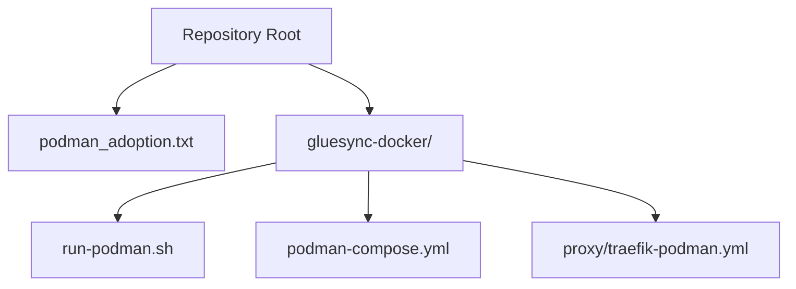
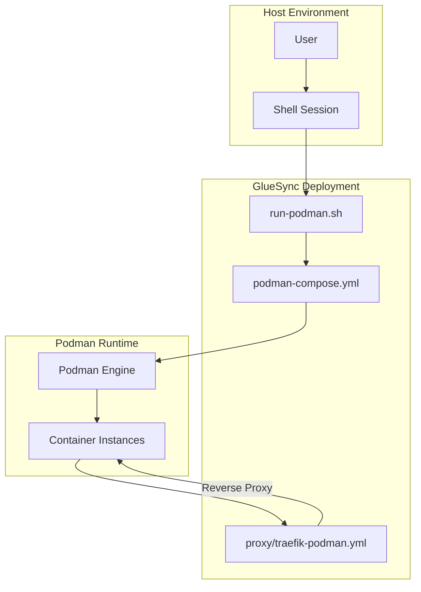
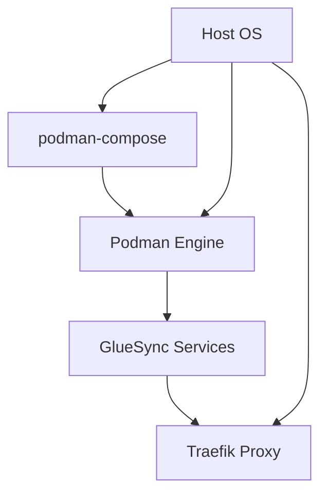

# Troubleshooting Guide

<cite>
**Referenced Files in This Document**
- [podman_adoption.txt](file://podman_adoption.txt)
</cite>

## Table of Contents
1. [Introduction](#introduction)
2. [Project Structure](#project-structure)
3. [Core Components](#core-components)
4. [Architecture Overview](#architecture-overview)
5. [Detailed Component Analysis](#detailed-component-analysis)
6. [Dependency Analysis](#dependency-analysis)
7. [Performance Considerations](#performance-considerations)
8. [Troubleshooting Guide](#troubleshooting-guide)
9. [Conclusion](#conclusion)

## Introduction
This guide provides a comprehensive troubleshooting methodology for Podman adoption and GlueSync deployment issues. It focuses on practical, step-by-step diagnostics for common problems such as podman-compose installation failures, permission errors, service startup issues, network connectivity problems, port conflicts, configuration errors, and performance/resource management. The content synthesizes actionable steps derived from the repository’s command history and deployment artifacts.

## Project Structure
The repository contains a single file that documents a real-world adoption scenario for deploying GlueSync using Podman. The file captures commands executed during setup, including ownership and permissions adjustments, podman-compose installation attempts, and verification steps.

**Diagram sources**
- [podman_adoption.txt:1-17](file://podman_adoption.txt#L1-L17)

**Section sources**
- [podman_adoption.txt:1-17](file://podman_adoption.txt#L1-L17)

## Core Components
- Deployment orchestration script: A shell script orchestrating container lifecycle and service startup.
- Podman compose configuration: Defines services, networks, volumes, and proxy routing for GlueSync.
- Traefik reverse proxy configuration: Manages ingress traffic and routing for exposed services.
- Command history: Documents installation, ownership, and verification steps performed during adoption.

Key operational elements captured:
- Ownership and permissions adjustments for scripts and configuration files.
- Installation attempts for podman-compose and subsequent manual installation via pip.
- Verification of podman-compose availability and version.

**Section sources**
- [podman_adoption.txt:1-17](file://podman_adoption.txt#L1-L17)

## Architecture Overview
The deployment uses Podman to manage containers orchestrated by podman-compose. A reverse proxy (Traefik) routes external traffic to internal services. The following diagram maps the documented components and their relationships.

**Diagram sources**
- [podman_adoption.txt:1-17](file://podman_adoption.txt#L1-L17)

## Detailed Component Analysis

### Orchestration Script
Purpose:
- Executes container lifecycle operations and service startup for GlueSync.

Common issues:
- Permission denied errors when running the script.
- Missing executable bit or incorrect ownership.
- Failure to locate podman-compose or conflicting Docker Compose installations.

Diagnostic steps:
- Verify executable permissions and ownership of the script.
- Confirm the working directory and path correctness.
- Check for presence of podman-compose and resolve conflicts with Docker Compose.

Resolution actions:
- Apply executable permissions and correct ownership.
- Ensure the working directory points to the GlueSync deployment folder.
- Install podman-compose via pip and update PATH if necessary.

**Section sources**
- [podman_adoption.txt:1-17](file://podman_adoption.txt#L1-L17)

### Podman Compose Configuration
Purpose:
- Defines services, networks, volumes, and proxy routing for GlueSync.

Common issues:
- YAML syntax errors or indentation problems.
- Missing or invalid service definitions.
- Network or volume mount misconfigurations.

Diagnostic steps:
- Validate YAML syntax and indentation.
- Confirm service names, ports, and volumes match runtime expectations.
- Review network configurations and inter-service dependencies.

Resolution actions:
- Fix YAML syntax errors and re-validate configuration.
- Align service definitions with intended deployment topology.
- Adjust network and volume mounts to match host environment.

**Section sources**
- [podman_adoption.txt:1-17](file://podman_adoption.txt#L1-L17)

### Traefik Reverse Proxy Configuration
Purpose:
- Routes external traffic to internal GlueSync services.

Common issues:
- Port conflicts with other services.
- Incorrect route definitions or missing middleware.
- TLS configuration mismatches.

Diagnostic steps:
- Inspect port assignments and verify availability.
- Validate route rules and middleware configurations.
- Confirm TLS certificates and domains align with deployment.

Resolution actions:
- Change conflicting ports or remove competing services.
- Correct route definitions and ensure middleware is enabled.
- Update TLS settings to match certificate paths and domains.

**Section sources**
- [podman_adoption.txt:1-17](file://podman_adoption.txt#L1-L17)

### Command History and Installation Flow
Purpose:
- Demonstrates the adoption process and highlights common pitfalls.

Highlights:
- Initial ownership and permissions adjustments.
- Attempted installation of podman-compose via package manager.
- Manual installation via pip and PATH updates.
- Verification of podman-compose availability.

Diagnostic steps:
- Confirm ownership and permissions for all configuration files and scripts.
- Validate package manager availability and repository updates.
- Ensure pip installation completes and PATH is updated.
- Verify podman-compose version output.

Resolution actions:
- Apply ownership and executable permissions.
- Install podman-compose via pip and refresh shell session.
- Re-run verification steps to confirm successful installation.

**Section sources**
- [podman_adoption.txt:1-17](file://podman_adoption.txt#L1-L17)

## Dependency Analysis
The deployment depends on:
- Podman engine for container runtime.
- podman-compose for orchestration.
- Traefik for reverse proxying.
- Host system resources and network configuration.

Potential dependency issues:
- Conflicting Docker Compose installations.
- Missing or outdated Python packages.
- Insufficient host privileges for container operations.

Mitigation strategies:
- Remove Docker Compose conflicts and rely solely on podman-compose.
- Install required Python packages and ensure PATH updates.
- Verify host privileges and SELinux/AppArmor policies if applicable.

**Diagram sources**
- [podman_adoption.txt:1-17](file://podman_adoption.txt#L1-L17)

**Section sources**
- [podman_adoption.txt:1-17](file://podman_adoption.txt#L1-L17)

## Performance Considerations
- Resource allocation: Ensure adequate CPU and memory for containerized services.
- Storage: Monitor disk usage for logs and persistent volumes.
- Networking: Optimize reverse proxy configurations to reduce latency.
- Scaling: Evaluate horizontal scaling strategies for high-traffic scenarios.

[No sources needed since this section provides general guidance]

## Troubleshooting Guide

### Podman Compose Installation Failures
Symptoms:
- Package manager reports podman-compose not available.
- Installation attempts fail due to missing dependencies.

Diagnostics:
- Verify package manager repositories and update caches.
- Check for Python 3 and pip availability.
- Confirm PATH includes user-installed binaries.

Resolutions:
- Install Python 3 and pip if missing.
- Use pip to install podman-compose with user scope.
- Append user bin directory to PATH and reload shell configuration.
- Verify installation by checking podman-compose version.

**Section sources**
- [podman_adoption.txt:8-15](file://podman_adoption.txt#L8-L15)

### Permission Errors
Symptoms:
- Execution errors when running the orchestration script.
- Access denied messages for configuration files.

Diagnostics:
- Check file ownership and permissions for scripts and configs.
- Verify working directory path correctness.

Resolutions:
- Apply executable permissions to the script.
- Correct ownership to the current user/group.
- Ensure the working directory points to the GlueSync deployment folder.

**Section sources**
- [podman_adoption.txt:1-2](file://podman_adoption.txt#L1-L2)

### Service Startup Problems
Symptoms:
- Services fail to start or remain in restarting loops.
- Logs indicate configuration or dependency issues.

Diagnostics:
- Validate podman-compose configuration syntax and service definitions.
- Confirm network and volume mounts are correct.
- Check Traefik route definitions and port availability.

Resolutions:
- Fix YAML syntax errors and re-validate configuration.
- Align service definitions with intended deployment topology.
- Adjust network and volume mounts to match host environment.
- Resolve port conflicts and update Traefik route definitions.

**Section sources**
- [podman_adoption.txt:6-7](file://podman_adoption.txt#L6-L7)

### Network Connectivity Issues
Symptoms:
- Services cannot communicate internally or externally.
- Reverse proxy fails to route traffic.

Diagnostics:
- Inspect Traefik port assignments and verify availability.
- Validate route rules and middleware configurations.
- Confirm DNS resolution and domain bindings.

Resolutions:
- Change conflicting ports or remove competing services.
- Correct route definitions and enable required middleware.
- Update TLS settings to match certificate paths and domains.

**Section sources**
- [podman_adoption.txt:1-17](file://podman_adoption.txt#L1-L17)

### Port Conflicts
Symptoms:
- Traefik or service containers fail to bind to configured ports.
- Startup logs show address already in use.

Diagnostics:
- Identify processes using conflicting ports.
- Review Traefik and service port configurations.

Resolutions:
- Stop conflicting services or change port assignments.
- Ensure Traefik and service ports are unique and available.

**Section sources**
- [podman_adoption.txt:1-17](file://podman_adoption.txt#L1-L17)

### Configuration Errors
Symptoms:
- podman-compose fails to parse configuration files.
- Services do not start due to invalid settings.

Diagnostics:
- Validate YAML syntax and indentation.
- Confirm service names, ports, and volumes match runtime expectations.

Resolutions:
- Fix YAML syntax errors and re-validate configuration.
- Align service definitions with intended deployment topology.

**Section sources**
- [podman_adoption.txt:1-17](file://podman_adoption.txt#L1-L17)

### Logging Strategies and Debugging Techniques
Application-level:
- Enable verbose logging for Traefik and GlueSync services.
- Tail container logs to identify startup and runtime errors.

Infrastructure-level:
- Monitor system logs for SELinux/AppArmor denials.
- Check resource utilization (CPU, memory, disk) during peak loads.

Debugging workflow:
- Start with minimal configuration and gradually add components.
- Isolate issues by disabling optional services and routes.
- Use dry-run checks to validate configurations before applying.

**Section sources**
- [podman_adoption.txt:1-17](file://podman_adoption.txt#L1-L17)

### Performance Troubleshooting and Resource Management
- Monitor container resource usage and adjust limits if needed.
- Optimize reverse proxy configurations to reduce latency.
- Scale horizontally if throughput requirements increase.
- Regularly review and prune unused images and volumes.

[No sources needed since this section provides general guidance]

## Conclusion
This guide consolidates practical troubleshooting steps for Podman adoption and GlueSync deployment, grounded in the repository’s command history and deployment artifacts. By systematically addressing installation, permissions, configuration, networking, and performance concerns, teams can reliably operate containerized environments with Podman and podman-compose.