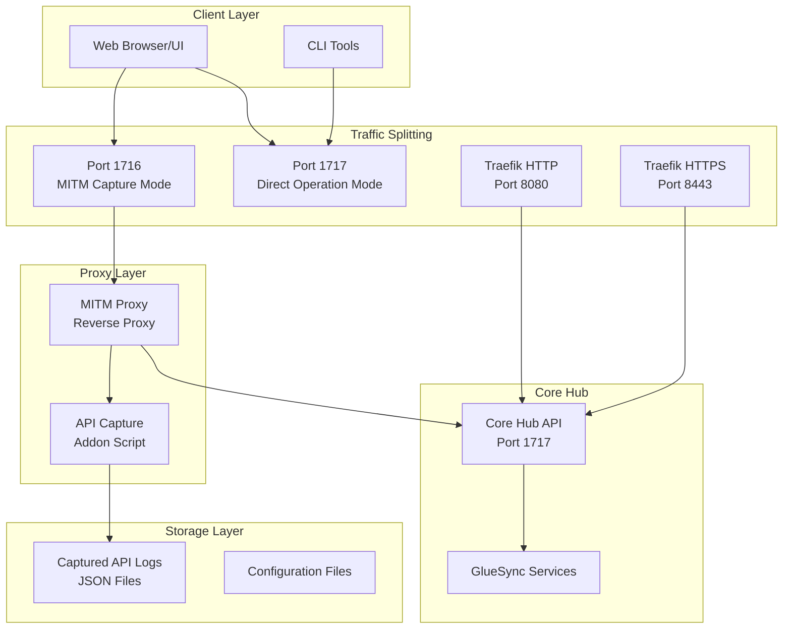
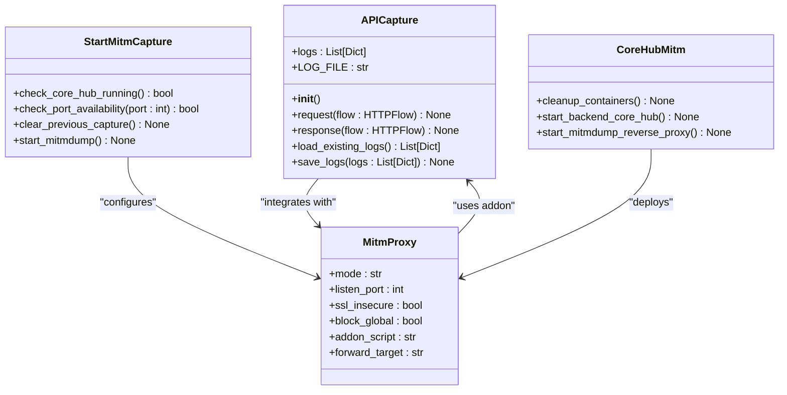
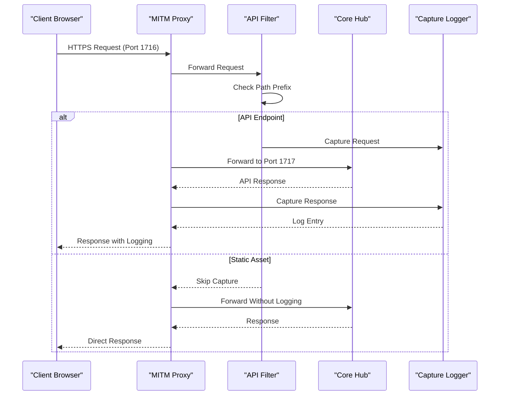
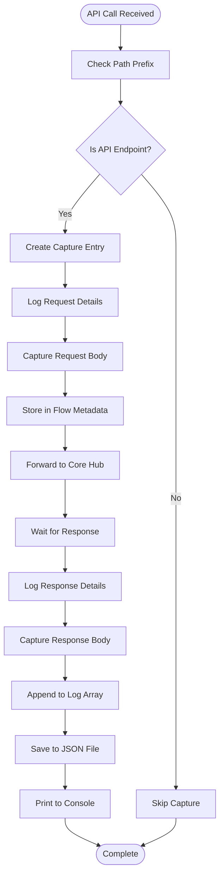
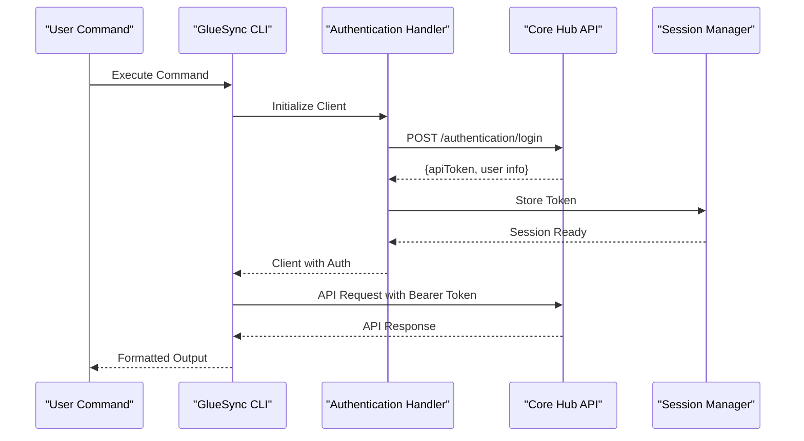
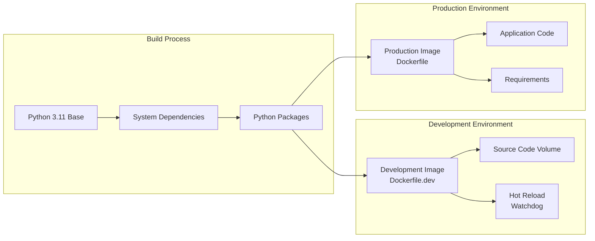
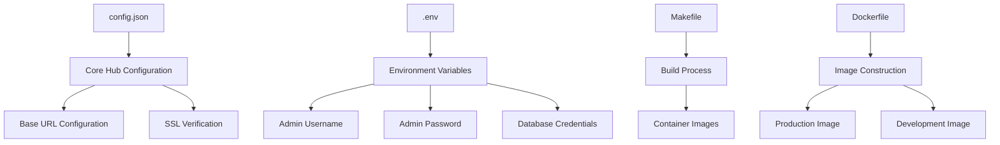
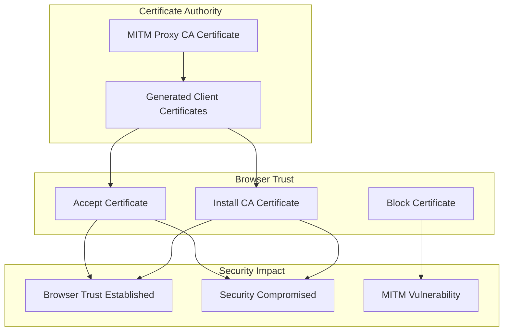

# MITM Proxy and API Capture Framework

<cite>
**Referenced Files in This Document**
- [README.md](file://README.md)
- [MITM_PROXY.md](file://MITM_PROXY.md)
- [MITM_SETUP.md](file://MITM_SETUP.md)
- [capture_api.py](file://capture_api.py)
- [start-mitm-capture.sh](file://start-mitm-capture.sh)
- [core-hub-mitm.sh](file://core-hub-mitm.sh)
- [gluesync_cli.py](file://gluesync_cli.py)
- [gluesync_cli_v2.py](file://gluesync_cli_v2.py)
- [requirements.txt](file://requirements.txt)
- [config.json](file://config.json)
- [docker-compose.yml](file://docker-compose.yml)
- [Makefile](file://Makefile)
- [Dockerfile](file://Dockerfile)
- [Dockerfile.dev](file://Dockerfile.dev)
- [scripts/tcp-proxy.py](file://scripts/tcp-proxy.py)
</cite>

## Table of Contents
1. [Introduction](#introduction)
2. [System Architecture](#system-architecture)
3. [MITM Proxy Components](#mitm-proxy-components)
4. [API Capture Framework](#api-capture-framework)
5. [CLI Integration](#cli-integration)
6. [Containerization Strategy](#containerization-strategy)
7. [Deployment Configuration](#deployment-configuration)
8. [Security Considerations](#security-considerations)
9. [Troubleshooting Guide](#troubleshooting-guide)
10. [Best Practices](#best-practices)
11. [Conclusion](#conclusion)

## Introduction

The MITM Proxy and API Capture Framework is a comprehensive toolset designed for GlueSync API discovery, reverse engineering, and automation development. This framework enables developers to capture, analyze, and document API interactions between the GlueSync Web UI and Core Hub services, facilitating the creation of automated CLI tools and integration scripts.

The framework consists of three primary components: a Man-in-the-Middle (MITM) proxy for traffic interception, a sophisticated API capture system with structured logging, and a robust CLI interface for programmatic API interaction. Together, these components provide a complete solution for API reverse engineering and automation development.

## System Architecture

The framework operates on a dual-port architecture principle, separating normal operations from capture mode to maintain optimal performance while enabling comprehensive API analysis.



**Diagram sources**
- [MITM_PROXY.md:37-60](file://MITM_PROXY.md#L37-L60)
- [README.md:41-91](file://README.md#L41-L91)

The architecture implements strict port separation to prevent conflicts between normal operations and capture activities. Port 1716 operates in capture mode with full traffic logging, while port 1717 maintains direct operation mode for optimal performance during regular use.

## MITM Proxy Components

### Core Proxy Infrastructure

The MITM proxy infrastructure consists of several interconnected components working together to provide comprehensive API capture capabilities.



**Diagram sources**
- [capture_api.py:30-89](file://capture_api.py#L30-L89)
- [start-mitm-capture.sh:1-51](file://start-mitm-capture.sh#L1-L51)
- [core-hub-mitm.sh:1-49](file://core-hub-mitm.sh#L1-L49)

### Traffic Interception Mechanism

The traffic interception mechanism operates through a sophisticated filtering system that captures only relevant API calls while excluding static assets and unnecessary traffic.



**Diagram sources**
- [capture_api.py:35-86](file://capture_api.py#L35-L86)
- [MITM_PROXY.md:136-157](file://MITM_PROXY.md#L136-L157)

**Section sources**
- [capture_api.py:1-90](file://capture_api.py#L1-L90)
- [start-mitm-capture.sh:1-51](file://start-mitm-capture.sh#L1-L51)
- [core-hub-mitm.sh:1-49](file://core-hub-mitm.sh#L1-L49)

## API Capture Framework

### Capture Logic Implementation

The API capture framework implements a comprehensive logging system that records complete request-response cycles with detailed metadata for each API interaction.



**Diagram sources**
- [capture_api.py:35-86](file://capture_api.py#L35-L86)

### Data Structure Design

The capture framework employs a structured data model that ensures comprehensive logging of API interactions while maintaining flexibility for various payload types.

| Field | Type | Description | Capture Conditions |
|-------|------|-------------|-------------------|
| `timestamp` | string | ISO format timestamp | Always captured |
| `method` | string | HTTP method (GET, POST, etc.) | Always captured |
| `url` | string | Full request URL | Always captured |
| `path` | string | Request path only | Always captured |
| `headers` | dict | Request headers | Always captured |
| `request_body` | dict/string | Parsed JSON body | Valid JSON only |
| `request_body_raw` | string | Hex-encoded raw body | Invalid JSON only |
| `status_code` | int | HTTP status code | Response captured |
| `response_headers` | dict | Response headers | Response captured |
| `response_body` | dict/string | Parsed JSON response | Valid JSON only |
| `response_body_raw` | string | Hex-encoded raw response | Invalid JSON only |

**Section sources**
- [capture_api.py:41-79](file://capture_api.py#L41-L79)

## CLI Integration

### Authentication and Session Management

The CLI integration provides seamless authentication and session management for programmatic API interaction, mirroring the authentication flow captured during MITM sessions.



**Diagram sources**
- [gluesync_cli.py:57-79](file://gluesync_cli.py#L57-L79)

### Command Structure and Routing

The CLI implements a sophisticated command routing system that supports both legacy and modern command patterns, enabling flexible API interaction for automation development.

| Command Pattern | Description | Usage Example |
|----------------|-------------|---------------|
| `gluesync-cli <action> <resource> [id] --flags` | Modern kubectl-style commands | `gluesync-cli get pipelines` |
| `gluesync-cli <resource> <action> [id] --flags` | Legacy command format | `gluesync-cli pipeline list` |
| `gluesync-cli <category> <action> [options]` | Resource-focused commands | `gluesync-cli entity start <id>` |

**Section sources**
- [gluesync_cli.py:574-743](file://gluesync_cli.py#L574-L743)
- [gluesync_cli_v2.py:67-111](file://gluesync_cli_v2.py#L67-L111)

## Containerization Strategy

### Multi-Stage Build Process

The containerization strategy implements a multi-stage approach supporting both production and development environments with optimized build processes and runtime configurations.



**Diagram sources**
- [Dockerfile:1-40](file://Dockerfile#L1-L40)
- [Dockerfile.dev:1-24](file://Dockerfile.dev#L1-L24)

### Container Orchestration

The framework utilizes Docker Compose for orchestrating multi-container deployments, supporting both standalone CLI operations and integrated development environments.

| Service | Purpose | Configuration | Volumes |
|---------|---------|---------------|---------|
| `gluesync-cli` | Production CLI container | Production Dockerfile | Config, Data, Scripts |
| `gluesync-cli-dev` | Development container | Development Dockerfile | Source Code, Environment |
| `networks` | Container networking | Bridge driver | Shared networking |

**Section sources**
- [docker-compose.yml:1-52](file://docker-compose.yml#L1-L52)
- [Makefile:17-112](file://Makefile#L17-L112)

## Deployment Configuration

### Environment Setup

The deployment configuration supports flexible environment variable management and externalized credential storage for secure operations across different environments.



**Diagram sources**
- [config.json:1-34](file://config.json#L1-L34)
- [Makefile:80-95](file://Makefile#L80-L95)

### Port Configuration Matrix

The framework implements a comprehensive port management system supporting multiple access patterns and operational modes.

| Port | Service | Purpose | Capture Mode | Direct Mode |
|------|---------|---------|--------------|-------------|
| **1716** | MITM Proxy | API capture and logging | ✅ Active | ❌ Inactive |
| **1717** | Core Hub | Direct API access | ❌ Inactive | ✅ Active |
| **8080** | Traefik | HTTP reverse proxy | ❌ Inactive | ✅ Active |
| **8443** | Traefik | HTTPS reverse proxy | ❌ Inactive | ✅ Active |
| **80** | TCP Proxy | HTTP forwarding | ❌ Inactive | ✅ Active |
| **443** | TCP Proxy | HTTPS forwarding | ❌ Inactive | ✅ Active |

**Section sources**
- [MITM_PROXY.md:69-82](file://MITM_PROXY.md#L69-L82)
- [scripts/tcp-proxy.py:1-72](file://scripts/tcp-proxy.py#L1-L72)

## Security Considerations

### Certificate Management

The MITM proxy framework implements secure certificate handling mechanisms to balance functionality with security requirements during API capture operations.



**Diagram sources**
- [MITM_SETUP.md:184-184](file://MITM_SETUP.md#L184-L184)

### Sensitive Data Protection

The framework implements comprehensive measures to protect sensitive data captured during API interactions, including automatic sanitization and secure storage practices.

| Data Type | Protection Level | Storage Location | Retention Policy |
|-----------|------------------|------------------|------------------|
| Authentication Tokens | High | Encrypted JSON | Immediate Deletion |
| Database Credentials | Highest | Environment Variables | Never Stored |
| API Keys | High | External Secrets | Immediate Deletion |
| Request Bodies | Medium | JSON Logs | 7-day Rotation |
| Response Bodies | Medium | JSON Logs | 7-day Rotation |

**Section sources**
- [MITM_SETUP.md:238-250](file://MITM_SETUP.md#L238-L250)
- [MITM_PROXY.md:284-321](file://MITM_PROXY.md#L284-L321)

## Troubleshooting Guide

### Common Issues and Solutions

The framework provides comprehensive troubleshooting guidance for common operational issues encountered during MITM proxy setup and API capture operations.

| Issue Category | Symptoms | Diagnostic Steps | Resolution |
|----------------|----------|------------------|------------|
| **Port Conflicts** | Connection refused errors | `ss -tlnp \| grep :1716` | Kill conflicting process or change port |
| **Certificate Errors** | SSL handshake failures | Check browser certificate warnings | Accept certificate or install CA |
| **Capture Failures** | Empty log files | Verify traffic goes through 1716 | Check proxy configuration |
| **Authentication Issues** | 401/403 errors | Validate credentials in .env | Update environment variables |
| **Network Connectivity** | Connection timeouts | Test Core Hub accessibility | Verify network configuration |

### Performance Optimization

The framework includes performance monitoring and optimization guidelines for high-volume API capture scenarios.

**Section sources**
- [MITM_PROXY.md:284-321](file://MITM_PROXY.md#L284-L321)
- [MITM_SETUP.md:220-237](file://MITM_SETUP.md#L220-L237)

## Best Practices

### Operational Guidelines

The framework establishes comprehensive best practices for secure and efficient MITM proxy operations, ensuring reliable API capture and minimal impact on production systems.

```mermaid
mindmap
root((Best Practices))
Security
Certificate Management
Credential Protection
Log Sanitization
Performance
Port Separation
Traffic Filtering
Log Rotation
Operational
Incremental Capture
Environment Isolation
Monitoring
Development
API Documentation
Automation Scripts
Testing Protocols
```

### Capture Strategy Recommendations

The framework recommends strategic approaches to API capture that maximize information density while minimizing operational overhead and security risks.

**Section sources**
- [MITM_PROXY.md:324-331](file://MITM_PROXY.md#L324-L331)
- [README.md:396-414](file://README.md#L396-L414)

## Conclusion

The MITM Proxy and API Capture Framework provides a comprehensive solution for GlueSync API discovery, reverse engineering, and automation development. Through its sophisticated traffic interception mechanisms, structured logging system, and robust CLI integration, the framework enables developers to efficiently analyze API interactions and develop automated solutions.

The framework's multi-environment support, comprehensive security measures, and operational best practices ensure reliable deployment across diverse environments while maintaining optimal performance and security standards. By leveraging the captured API data and structured logging capabilities, development teams can accelerate automation development and integration projects with confidence in their understanding of GlueSync's API behavior.

The modular architecture and containerized deployment strategy facilitate easy integration into existing development workflows, while the comprehensive documentation and troubleshooting guidance ensure successful adoption and operation across different organizational contexts.