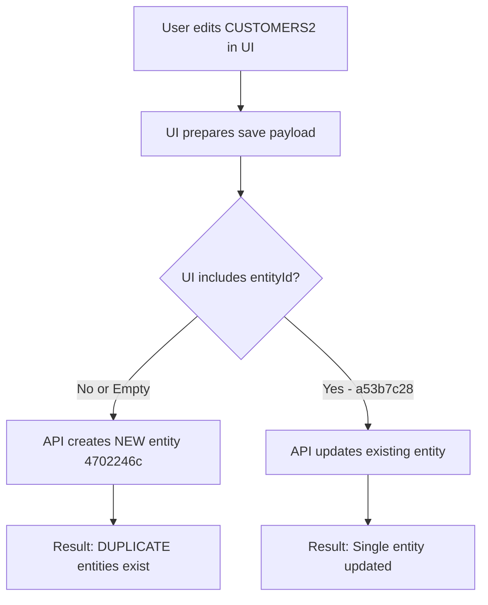

# ⚠️ CRITICAL: Entity Duplication Bug Analysis

## Issue Summary

**Symptom**: After editing CUSTOMERS2 entity in UI (deselecting _RRN field) and saving, TWO entities with the same table mapping appeared:
- `a53b7c28` - Original entity (edited, no _RRN)
- `4702246c` - Duplicate entity (created on save)

## Root Cause

### The Problem: `PUT /pipelines/{id}/config/entities` is an UPSERT Endpoint

This API endpoint does NOT work like a simple "update" operation. Instead, it:

1. **Replaces ALL entities** in the pipeline configuration
2. **Creates new entity** if `entityId` is empty or missing
3. **Updates existing entity** only if valid `entityId` is provided
4. **Requires ALL entities** to be included in the payload

### What Happened Step-by-Step:



### Evidence from Entity Comparison:

| Field | Entity a53b7c28 (Original) | Entity 4702246c (Duplicate) |
|-------|---------------------------|----------------------------|
| **entityId** | `a53b7c28` | `4702246c` |
| **entityName** | `GSLIBTST.CUSTOMERS2` | `GSLIBTST.CUSTOMERS2` |
| **Source Table** | `GSLIBTST.CUSTOMERS2` | `GSLIBTST.CUSTOMERS2` |
| **Target Table** | `dbo.customers2` | `dbo.customers2` |
| **Source Agent** | `d74fad4b` | `d74fad4b` |
| **Target Agent** | `a75b0db9` | `a75b0db9` |
| **columnsMappingMatrix** | `[]` (empty - 0 entries) | `[...]` (populated - 20 entries) |
| **_RRN in columns** | No | No |
| **Group ID** | `_default` | `_default` |

**Key Difference**: The duplicate has a populated `columnsMappingMatrix` from the UI save operation.

## API Behavior Details

### Incorrect Usage (Creates Duplicate):

```python
# ❌ WRONG - This creates a NEW entity
payload = {
    "entities": [{
        "entityId": "",  # Empty = new entity!
        "entityName": "GSLIBTST.CUSTOMERS2",
        "agentEntities": [...]
    }]
}
PUT /pipelines/32c1dc34/config/entities
# Result: Creates duplicate 4702246c
```

### Correct Usage (Updates Existing):

```python
# ✅ CORRECT - This updates the existing entity
payload = {
    "entities": [
        {
            "entityId": "a53b7c28",  # Must include existing ID!
            "entityName": "GSLIBTST.CUSTOMERS2",
            "agentEntities": [...]
        },
        {
            "entityId": "db55f818",  # Must include ALL other entities too!
            "entityName": "GSLIBTST.CUSTOMERS",
            "agentEntities": [...]
        },
        # ... all other entities must be included
    ]
}
PUT /pipelines/32c1dc34/config/entities
# Result: Updates existing entity without duplication
```

## Why Our CLI Has This Bug

In `gluesync_cli_v2.py`, the `create_entity()` method sends:

```python
entity_data = {
    "entities": [
        {
            "entityId": "",  # ❌ Empty - will create duplicates on subsequent calls!
            "agentEntityId": "",  # ❌ Also empty
            ...
        }
    ]
}
```

**This is fine for creating NEW entities**, but if called multiple times for the same table, it will create duplicates.

## Impact on CLI Implementation

### Current Behavior:
1. `create entity` command → Creates new entity with empty `entityId` ✅ (correct for new)
2. UI "Save" after edit → May create duplicate if UI doesn't preserve `entityId` ❌ (bug in UI behavior)
3. No "update entity" command → Cannot safely modify existing entities ⚠️ (missing feature)

### What's Missing:

1. **`update entity` command** - Should fetch existing entity, modify, and send back with preserved `entityId`
2. **Validation** - Should check if entity already exists before creating
3. **Full payload requirement** - Must understand that PUT expects ALL entities, not just one

## Solutions

### Immediate Fix (Delete Duplicate):

```bash
# Delete the duplicate entity
python3 gluesync_cli_v2.py delete entity 4702246c --pipeline 32c1dc34
```

### Long-term Fixes Needed:

#### 1. Add `update entity` Command:

```python
def update_entity(self, pipeline_id: str, entity_id: str, **updates):
    """Update an existing entity while preserving its ID"""
    # 1. Fetch ALL current entities
    all_entities = self.list_entities(pipeline_id)
    
    # 2. Find and update the target entity
    for entity in all_entities:
        if entity.get('entityId') == entity_id:
            entity.update(updates)
            break
    
    # 3. Send ALL entities back (preserving all entityIds)
    payload = {"entities": all_entities}
    return self.request("PUT", f"/pipelines/{pipeline_id}/config/entities", json=payload)
```

#### 2. Add Duplicate Detection:

```python
def create_entity_safe(self, pipeline_id: str, source_library: str, source_table: str, ...):
    """Create entity only if it doesn't already exist"""
    # Check for existing entity with same table mapping
    existing = self.list_entities(pipeline_id)
    entity_name = f"{source_library}.{source_table}"
    
    for entity in existing:
        if entity.get('entityName') == entity_name:
            raise Exception(f"Entity {entity_name} already exists (ID: {entity.get('entityId')})")
    
    # Safe to create
    return self.create_entity(pipeline_id, source_library, source_table, ...)
```

#### 3. Fix UI Workflow Documentation:

Add warning to WORKFLOW_GUIDE.md:

```markdown
## ⚠️ Warning: Editing Entities in UI

When editing an entity in the GlueSync UI and clicking "Save":
- The UI may create a DUPLICATE entity instead of updating
- This happens because the UI sends a payload with empty `entityId`
- **Always check entity list after saving edits**
- If duplicate appears, delete it via CLI:
  ```bash
  python3 gluesync_cli_v2.py delete entity <duplicate_id> --pipeline <pipeline_id>
  ```
```

## MITM Capture Status

**Question**: Did we capture the UI save API call that caused this?

**Answer**: The previous session was interrupted before we could analyze the group/chain APIs, 
but the CUSTOMERS2 entity creation was captured. The issue is that:

1. Initial creation via CLI used empty `entityId` ✅ (correct for creation)
2. UI edit/save likely also used empty `entityId` ❌ (causes duplication)

**Recommendation**: Capture the UI save operation with MITM proxy to see exact payload structure.

## Best Practices Going Forward

### For CLI Users:
1. ✅ Use `create entity` for new tables
2. ⚠️ Check if entity exists before creating: `get entities --pipeline <id>`
3. ❌ Don't call `create entity` multiple times for same table
4. ✅ Use `delete entity` to remove duplicates

### For UI Users:
1. ✅ Editing entity fields is safe
2. ⚠️ After saving, verify only ONE entity exists for the table
3. ✅ Delete duplicates via CLI if they appear

### For Development:
1. Implement `update entity` command that preserves `entityId`
2. Add duplicate detection to `create entity`
3. Document the UPSERT behavior clearly
4. Consider if API has a true "update single entity" endpoint we haven't discovered

## Related Files

- `gluesync_cli_v2.py` - `create_entity()` method (line 148-296)
- `gluesync_cli_v2.py` - `delete_entity()` method (line 298-309)
- MITM capture logs in conversation history
- Entity comparison output: `/home/ubuntu/.qoder/cache/projects/_qoder-8d48799b/agent-tools/703472b6/5073abd7.txt`

## Next Steps

1. ✅ Delete duplicate entity `4702246c`
2. ⚠️ Warn user about UI save behavior
3. 📝 Update WORKFLOW_GUIDE.md with this warning
4. 🔧 Implement `update entity` command (requires MITM capture of update operation)
5. 🧪 Test with ORDERS table to ensure no duplication occurs
